# 섹션 4

producer는 해당 Topic의 파티션 리더 브로커에게만 메시지를 송신한다.

* 리더란, 파티션이 복제되어있을때 복제되는 대상(팔로워들이 복제함)

**`acks` 설정**:

- `0`: 메시지 전송만 하고 응답을 기다리지 않음. 가장 빠르지만 데이터 손실 위험.
  - 메시지가 제대로 전송되었는지 브로커로 부터 확인을 받지 않기 때문에 메시지가 브로커에 기록되지 않더라도 재 전송하지 않음
- `1`: 리더 파티션의 확인만 받음. 기본값.
  - 리더가 메시지 수신 후 적재중 다운될경우 다른 브로커에는 복제되지 않았으므로 메시지 소실 우려 있음 
- `all`: 모든 복제본의(레플리카) 확인을 받음. 가장 신뢰성 높음.
  - min.insync.replicas 수(최소 복제 완료 수) 만큼 레플리카에 복제 수행 후 리더 브로커가 확인 후에 ack 전송 
  - **`min.insync.replicas` > 파티션 복제본 수**:
    - 설정 값이 복제본 수를 초과하면 메시지 전송이 항상 실패하므로 적절한 복제본 수를 설정해야 함.


### acks 0

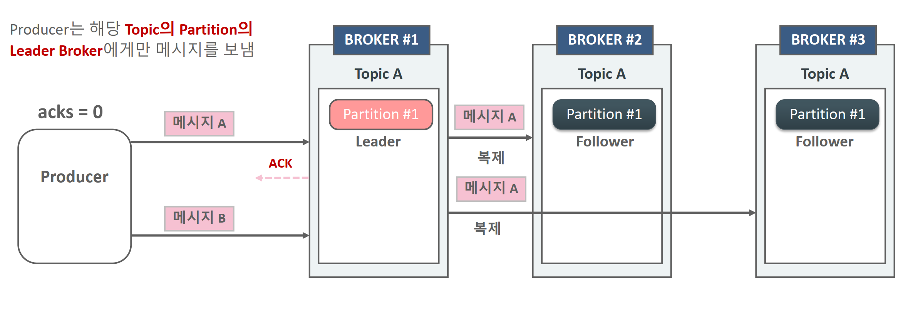

- Producer는 Leader broke가 메시지 A를 정상적으로 받았는지에 대한 Ack 메시지를 받지 않고 다음 메시지인 메시지 B를 바로 전송
- 메시지가 제대로 전송되었는지 브로커로 부터 확인을 받지 않기 때문에 메시지가 브로커에 기록되지 않더라도 재 전송하지 않음
- 메시지 손실의 우려가 가장 크지만 가장 빠르게 전송할 수 있음(IOT 센서 데이터등 데이터의 손실에 민감하지 않은 데이터 전송에 활용)

### acks 1

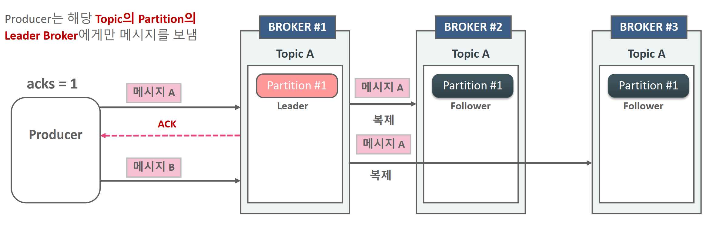

*  Producer는 Leader broke가 메시지 A를 정상적으로 받았는지에 대한 Ack 메시지를 받은 후 다음 메시지인 메시지 B를 바로 전송. 만약 오류 메시지를 브로커로 부터 받으면 메시지 A를 재 전송.

*  메시지 A가 모든 Replicator에 완벽하게 복사되었는지의 여부는 확인하지 않고 메시지 B를 전송.

*  만약 Leader가 메시지를 복제 중에 다운될 경우 다음 Leader가 될 브로커에는 메시지가 없을 수 있기 때문에 메시지를 소실할 우려가 있음.

### acks all

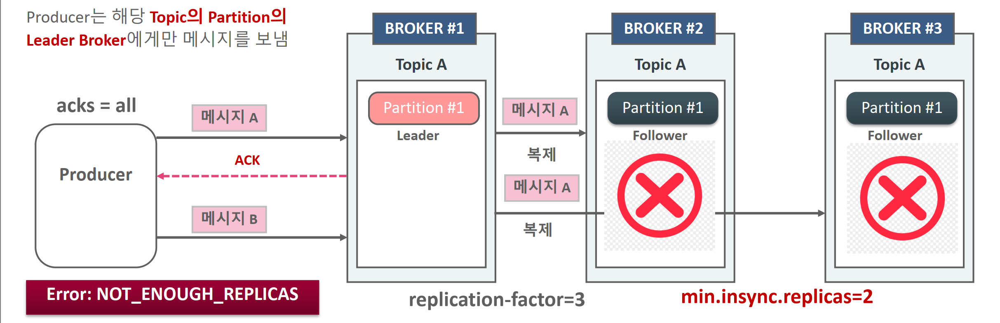

* Producer는 Leader broke가 메시지 A를 정상적으로 받은 뒤 min.insync replicas 개수 만큼의 Replicator에 복제를 수행한 뒤에 보내는 Ack 메시지를 받은 후 다음 메시지인 메시지 B를 바로 전송. 만약 오류 메시지를 브로커로 부터 받으면 메시지 A를 재 전송.

* 메시지 A가 모든 Replicator에 완벽하게 복사되었는지의 여부까지 확인후에 메시지 B를 전송.

* 메시지 손실이 되지 않도록 모든 장애 상황을 감안한 전송 모드이지만 Ack를 오래 기다려야 하므로 상대적으로 전송속도가 느림.


acks 설정

```java
Properties props = new Properties();
props.setProperty(ProducerConfig.BOOTSTRAP_SERVERS_CONFIG, "127.0.0.1:9092");
props.setProperty(ProducerConfig.KEY_SERIALIZER_CLASS_CONFIG, StringSerializer.class.getName());
props.setProperty(ProducerConfig.VALUE_SERIALIZER_CLASS_CONFIG, StringSerializer.class.getName());

props.setProperty(ProducerConfig.ACKS_CONFIG, "0"); // 0, 1, all

//KafkaProducer object creation
KafkaProducer<String, String> kafkaProducer = new KafkaProducer<>(props);
```


### producer의 Sync와 Callback Async 에서의 acks와 retry

* Callback 기반의 async에서도 동일하게 acks 설정에 기반하여 retry가 수행됨

* Callback 기반의 async에서는 retry에 따라 Producer의 원래 메시지 전송 순서와 Broker에 기록되는 메시지 전송 순서가 변경 될 수 있음.

* Sync 방식에서 acks=0일 경우 전송 후 ack/error를 기다리지 않음(fire and forget).


### 메시지 배치 전송의 이해

메시지가 전송되는 순서는 다음과 같다

* 직렬화 -> 파티션 결정 -> 압축(선택) -> Record Accumulator 저장 -> 별도의 Thread에서 전송

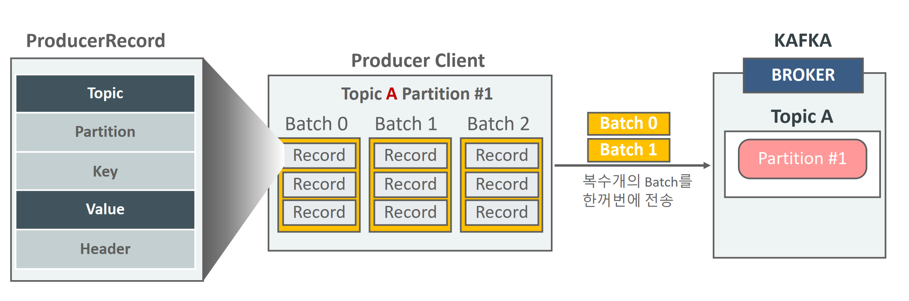

카프카는 메시지를 내부 메모리에 단일 메시지를, 파티션에 따라 레코드 배치단위로 묶어 전송한다.

buffer.memory 설정(바이트) 만큼 보관될 수 있으며 이게 다 차면 전송하거나 시간이 지나면 전송한다.

#### Kafka Producer Record Accumulator

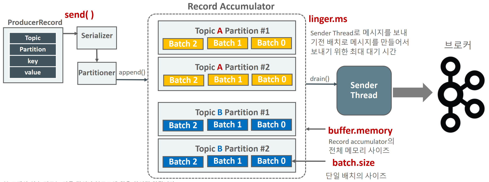

* Record Accumulator는 Partitioner에 의해서 메시지 배치가 전송이 될 토픽과 Partition에 따라 저장되는 KafkaProducer 메모리 영역

* Sender Thread는 Record Accumulator에 누적된 메시지 배치를 꺼내서 브로커로 전송함.

* KafkaProducer의 Main Thread는 send() 메소드를 호출하고 Record Accumulator 에 데이터 저장하고 Sender Thread는 별개로 데이터를 브로커로 전송

### Producer의 linger.ms 와 batch.size 옵션

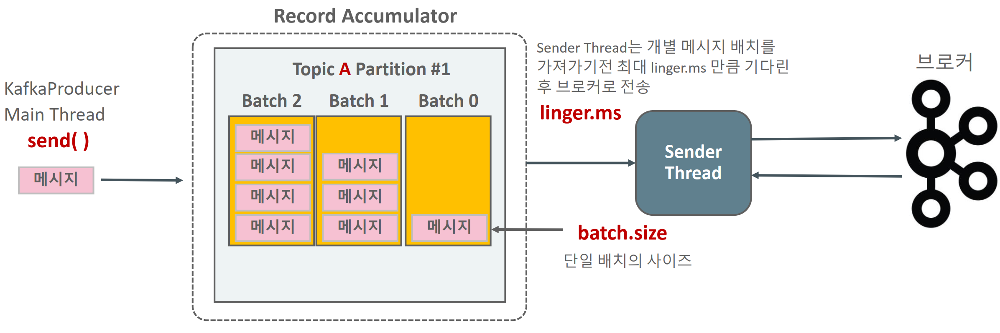

* Sender Thread는 기본적으로 전송할 준비가 되어 있으면 Record Accumulator에서 1개의 Batch를 가져갈수도, 여러 개의 Batch를 가져 갈 수도 있음. 또한 Batch에 메시지가 다 차지 않아도 가져 갈 수 있음.

* linger.ms를 0보다 크게 설정하여 Sender Thread가 하나의 Record Batch를 가져갈 때 일정 시간 대기하여 Record Batch에 메시지를 보다 많이 채울 수 있도록 적용
  * **`batch.size`**:  default 16KB 
    - 비동기 전송에서 한 번에 전송할 배치 크기. 크기를 너무 작게 설정하면 효율이 낮아지고, 너무 크게 설정하면 메모리 사용량 증가.
    - 배치 크기는 **압축되기 전 크기** 기준이며 메시지가 `batch.size`에 도달하지 않아도, **`linger.ms` 시간이 초과하면 배치를 전송**\
  * **`linger.ms`**: 기본값 0ms. 5~100ms 설정시 네트워크 효율 증가 
    - 비동기 전송 시 배치를 기다리는 시간. 설정 시간이 길수록 대기 후 전송하며, 성능에 영향을 줌.
    - 크기가 다 차지 않아도 시간이 되면 전송함. 
      - 반드시 0보다 크게 설정할 필요는 없다. 
    - 전반적인 Producer와 Broker간의 전송이 느리다면 linger.ms를 높여서 메시지가 배치로 적용될 수 있 는 확률을 높이는 시도를 해볼 만함. linger.ms는 보통 20ms 이하로 설정 권장

#### sync와 async callback에서의 batch

- 기본적으로 KafkaProducer객체의 send()메소드는 비동기(Async)이며 Batch 기반으로 메시지 전송
- Calback 기반의 Async는 비동기적으로 메시지를 보내면서 RecordMetadata를 Client가 받을 수 있는 방식을 제공
- Calback 기반의 Async는 여러 개의 메시지가 Batch로 만들어짐.
- Kafkaproducer.send(.get() 와 같은 방식으로 개별 메시지 별로 응 답을 받을 때까지 block이 되는 방식으로는 메시지 배치 처리가 불가. 전송은 배치레벨이지만 배치 에 메시지는 단 1개


## Producer 메시지 전송/ 재전송 시간 파라미터 이해

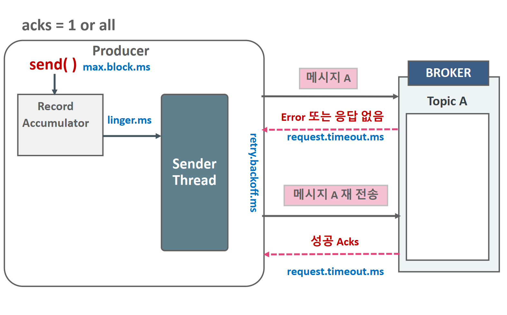

```
delivery.timeout.ms >= linger.ms + request.timeout.ms

Kafka 프로듀서의 메시지 전송과 관련된 시간 설정 간의 관계.
각각의 설정은 메시지 전송의 최대 지연 시간 및 전송 실패 처리에 영향을 미침 
```

> delivery.timeout.ms < linger.ms + request.timeout.ms 이면,
>
> - 아직 메시지를 배치로 모으기 위해 기다리는 동안(linger.ms) + 브로커 응답 대기(request.timeout.ms) 시간만큼은 필요할 텐데, 그보다 더 짧은 시간 내에 delivery.timeout.ms가 만료되어버려, 메시지가 실제로 성공할 수 있는 기회를 사전에 “실패”로 간주하는 상황이 발생할 수 있다.

* delivery.timeout.ms : 기본값: 120,000 ms (2분)

  - 메시지가 프로듀서에서 전송 요청된 시점부터 성공(ACK 수신) 또는 실패로 간주되기까지의 최대 허용 시간(밀리초).

  - 이 시간 내에 메시지가 전송되지 않으면 실패로 처리되며, `RetriesExhaustedException`이 발생할 수 있음.
  - 왜 중요한가
    - 만약 이 값이 너무 짧으면, 실제로는 브로커가 메시지를 받았어도 일시적 지연 때문에 ACK가 늦게 도착하면 실패로 잘못 간주될 수있고, 너무 길면, 프로듀서가 메시지 전송을 오랫동안 붙들고 있어서 장애 상황 인지가 늦어지고, 후속 처리가 지연될 수 있다.

* linger.ms : 기본값: 0 ms

  - 프로듀서가 메시지를 배치로 묶기 위해 기다리는 시간(밀리초).

  - 메시지가 도착하자마자 보내는 대신, 효율성을 위해 약간의 지연 시간을 두고 배치 전송.

* request.timeout.ms : 기본값: 30s
  - 브로커로 전송된 요청에 대해 응답을 기다리는 최대 시간(밀리초).
  - 브로커가 이 시간 내에 응답하지 않으면 실패로 간주하며, 프로듀서는 재시도를 시도할 수 있음.

* max.block.ms
  * 프로듀서의 `send()` 호출 시, 내부 버퍼(Record Accumulator)가 꽉 차거나(배출이 안 되면) 다른 원인으로 **블로킹**되는 상황에서 **최대 대기할 시간** 만약 이 시간이 max.block.ms를 초과하면, 프로듀서는 **TimeoutException**을 던짐.
    * 메시지 생산속도가 소비(또는 전송) 속도보다 훨씬 빠를 때, 버퍼가 꽉 차면 생산자는 send()에서 대기(block)하게 되며, 이때 시간이 너무 길면 서비스 장애로 이어질 수 있음. 

* retry.backoff.ms : 재전송을 위한 대기 시간 
  * 너무 짧으면 대규모 트래픽에서 브로커가 복구되기도 전에 과도한 재시도가 발생할 수 있고, 너무 길면 복구 후에도 재전송이 지연될 수 있다. 

> 시나리오 1: **실시간 로그 처리 (지연에 민감, 메시지 양이 많음)**
>
> - 목표
>
>   : 로그를 최대한 빠르게 브로커로 보내야 하며, 지연이 너무 커지면 안 됨.
>
>   - 그러나 동시에 엄청난 양의 로그를 보내므로, 너무 자주 전송하면 오버헤드가 클 수 있음.
>
> - 설정 예시
>
>   - `linger.ms = 5~10 ms` 정도로 소폭 배치. (기본 0ms → 5~10ms로 늘려 네트워크 효율 개선)
>
>   - `request.timeout.ms = 30,000 ms` (기본값 사용, 혹은 약간 증가)
>
>   - ```
>     delivery.timeout.ms = 120,000 ms
>     ```
>
>      (기본 2분, 보통 그대로 사용)
>
>     - linger + request.timeout 합쳐도 여유가 충분함.
>
>   - `retry.backoff.ms = 100 ms` (실패 시 0.1초 간격으로 재시도)
>
> 이렇게 하면, 로그 생산에 따른 전송이 약간씩 지연되지만(최대 10ms), 네트워크 효율은 좋아지고, 한 번에 여러 레코드를 묶어 전송할 수 있다
>
>
> 시나리오 2: **불안정한 네트워크 환경에서 이벤트 전송**
>
> - **목표**: 네트워크 패킷 손실이나 지연이 잦은 상황에서 **재시도 로직**을 안정적으로 처리.
> - 설정 예시
>   - `linger.ms = 10~50 ms` (너무 길게 배치하지 않고, 안정적으로 전송)
>   - `request.timeout.ms = 60,000 ms` 이상 (네트워크 지연이 크므로 응답 대기 시간을 늘림)
>   - `delivery.timeout.ms = 180,000 ms` (3분 정도로 늘려서 재시도와 지연을 커버)
>   - `retry.backoff.ms = 1,000 ms` (1초 정도 대기 후 재시도, 네트워크가 복구될 시간을 줌)
>
> 네트워크가 자주 끊긴다면, ACK 수신에 더 많은 시간이 걸릴 수 있으므로 `request.timeout.ms`를 늘리고, 그만큼 `delivery.timeout.ms`도 증가


ackes가 1 또는 all일때, retries 설정 횟수 만큼 재전송 시도하다가, delivery.tmeout.ms가 되면 재전송이 중지된다.

* retries와 delivery.timeout.ms 를 이용하여 재 전송 횟수 조정 

* retries는 재 전송 횟수를 설정. 
* delivery.timeout.ms 는 메시지 재전송을 멈출때 까지의 시간 
* 보통 retries는 무한대값으로 설정하고 delivery.timeout.ms(기 본 120000, 즉 2분) 를 조정하는 것을 권장.

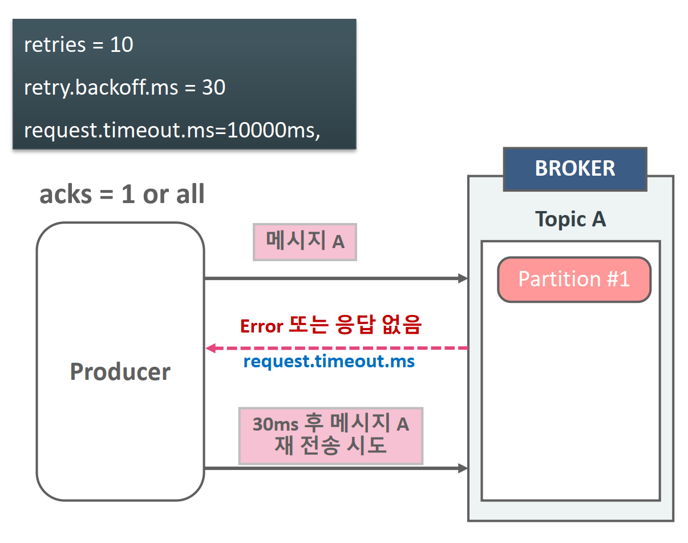

- retry.backoft.ms는 재 전송 주기 시간을 설정
- retries=10, request.timeout.ms=10000ms, retry.backoff.ms=30의 경우 request.timeout.ms 기다린후 재 전송하기전 30ms 이후 재전송 시도. 이와 같은 방식으로 재 전송을 10회 시도하고 더 이상 retry 시도 하지 않음.
- 만약 10회 이내에 delivery.timeout.ms에 도달하면 더 이상 retry 시도하지 않음.

#### max.in.flight.requests.per.connection

max.in.flight.requests.per.connection란, **브로커로 전송한 요청(Request)이 응답을 기다리는 동안 동시에 보낼 수 있는 최대 요청 수**를 설정하는 옵션 

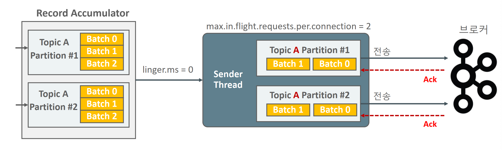

기본적으로 요청은 순서대로 처리되지만, 이 값을 증가시키면 **동시 요청**이 가능하여 성능이 향상될 수 있다.

**`max.in.flight.requests.per.connection` 기본값**: **5**

**값을 증가시키면**:

- **장점**: 처리량(Throughput)이 증가하여 성능이 개선될 수 있음.
- **단점**: 재시도(`retries`)가 활성화된 경우, 요청 순서가 뒤바뀌는(out-of-order) 현상이 발생할 수 있음.

**값을 낮추면**:

- **장점**: 메시지 순서가 보장되므로 데이터의 순서가 중요한 애플리케이션에서 유리.
- **단점**: 동시 요청이 감소하므로 처리량이 낮아질 수 있음.

#### 설정 주의사항

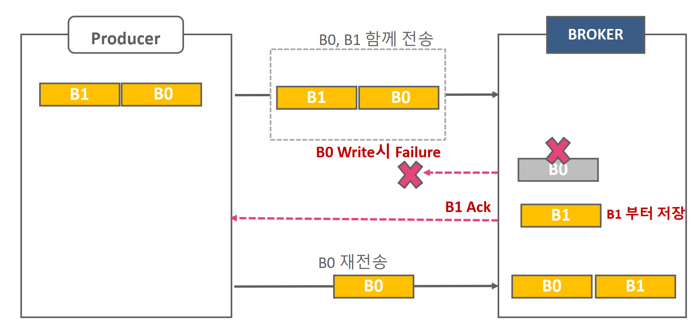

* BO가 B1보다 먼저 Producer에서 생성된 메시지 배치.
* max.infight.requests.per.connection = 2(>1) 에서 B0, B1 2개의 배치 메시지를 전송 시 B1은 성공적으로 기록 되었으나 B0의 경우, write되지 않고 Ack 전송이 되지 않는 Failure 상황이 된 경우 Producer는 B0를 재 전송하여 성공적으로 기록되며 Producer의 원래 메시지 순서와는 다르게 Broker에 저장 될 수 있음.
  * 멱등성 프로듀서인 enable.idempotence=true 설정으로 순서를 해결할 수 있긴 하다. 
  * **`enable.idempotence=true`**
    - 이 설정은 Kafka가 각 메시지에 고유한 **프로듀서 ID**와 **시퀀스 번호**를 추가하여 순서를 보장
    - 메시지가 브로커에 도착한 이후, Kafka는 메시지를 WAL에 기록하지만, 이때 **시퀀스 번호는 로그에 포함되지** 않고 메모리에 저장됌.
    - 따라서, `in-flight` 요청이 2 이상이고 재시도가 발생하더라도, Kafka는 메시지의 순서를 유지하고 중복 메시지가 저장되지 않도록 보장

1. **`retries`와의 관계**:
   - `retries` 옵션이 활성화된 경우, 요청 재시도로 인해 순서 역전 문제가 발생할 수 있음.
   - 이 경우 순서를 보장하려면 `max.in.flight.requests.per.connection=1`로 설정.
2. **`acks`와의 관계**:
   - `acks=all`로 설정하면 메시지 신뢰성이 높아지고, 순서 역전 가능성도 줄어듦.
3. **`batch.size` 및 네트워크 조건**:
   - 높은 처리량을 유지하려면 배치 크기(`batch.size`)와 네트워크 대역폭을 고려하여 최적화 필요.

### 최대 한번 전송, 적어도 한번 전송, 정확히 한번 전송

* 최대 한번 전송(at most once) - 중복 x 

* 적어도 한번 전송(at least once) - 중복 허용 -> retry, ack 1, all 

* 정확히 한번 전송(exactly once) -> 
  * 중복 없이 전송(Idempotence): Producer의 message 전송 retry시 중복 제거 
  * Transaction 기반 전송 

#### At Most Once (최대 한 번 전송)

Producer는 브로커로 부터 ACK또는 에러 메시지 없이 다음 메시지를 연속적으로 보냄.

메시지가 소실 될 수는 있지만 중복 전송은 하지 않음.

즉, 메시지가 생산(Producer) → 브로커(Kafka) → 소비(Consumer)로 가는 과정에서,

- **중복**은 발생하지 않지만,
- 어떤 이유로든 메시지가 소실될 수 있어도 괜찮은(허용하는) 시나리오에 적합

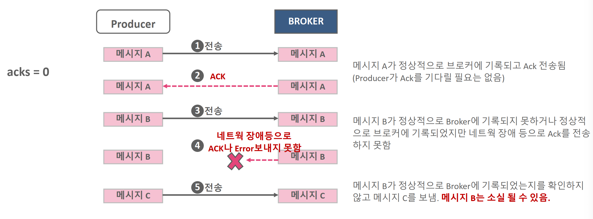

* 주로 **소비자(Consumer)에서 메시지를 읽고, 그 즉시 오프셋(Offset)을 커밋**

* 메시지를 아직 처리하기도 전에, “읽었다”라고 브로커에 알려버리는 방식.

  처리 중 장애가 발생하면, 해당 메시지를 다시 읽을 기회가 없으므로 “놓침”이 발생할 수 있다.

  단, 이미 “읽었다”로 간주했으므로 **중복**은 발생하지 않음.

* 로그 수집이나 성능과 간단한 구조 중요시 사용

* 신뢰도가 높은 시스템(금융 거래, 정산 등)에는 적합하지 않다. 

#### At Least Once (적어도 한번 전송 )

Producer는 브로커로 부터 ACK를 받은 다음에 다음 메시지 전송. 메시지 소실은 없지만 중복 전송을 할 수 있음

* 즉, **메시지 손실은 최소화**하지만(0에 가깝게), 중복 처리가 발생할 수 있다. 

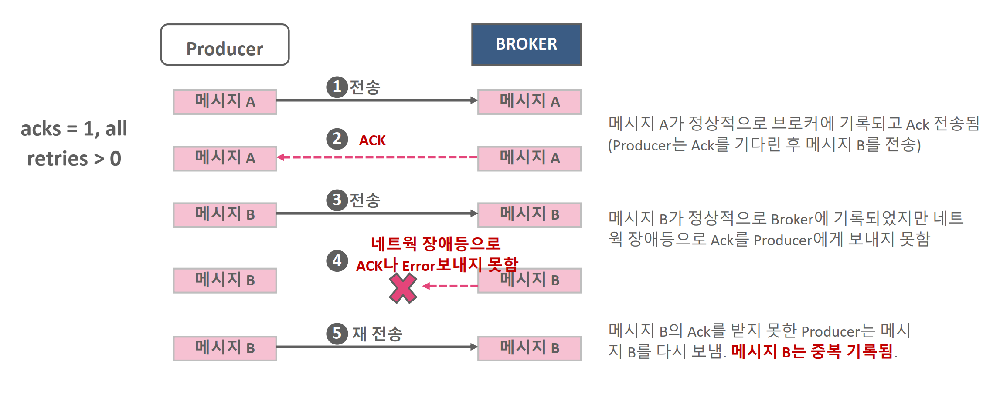

* **소비자(Consumer)가 메시지를 처리한 후에 오프셋을 커밋하는 경우 **.
  - 메시지를 실제로 “처리”한 뒤에, “이제 이 메시지를 읽었다”고 브로커에 보고
  - 만약 처리 완료 전에 장애가 나면, 재시작 시점에서 해당 메시지를 다시 가져와 처리
  - 그 결과, **중복** 처리(두 번 이상 처리) 가능성이 생김.
* **프로듀서(Producer) 재시도 시**
  - 네트워크나 브로커 응답 지연으로 인해 프로듀서가 동일 메시지를 여러 번 보낼 수 있다 (idempotent 설정이 없는 경우).
* 일반적인 이벤트 수집 처리 파이프라인 사용
  * 어떤 메시지가 중복으로 처리되어도 비즈니스적으로 큰 문제는 없는 경우 
* 메시지 손실이 거의 없어서 **신뢰성**이 높지만, 중복 처리가 발생할 수 있어 애플리케이션 레벨에서 중복 체크가 필요. 

#### Exactly Once (정확히 한 번 전송)

**“정확히 한 번”**은 메시지를 **놓치지도 않고**, **중복 처리도 없는** 이상적인 전송 보장 모델.

매우 강력한 보장이나, 달성하기 위해서는 **추가적인 복잡성**과 **비용**이 든다. 

카프카에서의 구현 방식

3.1 Idempotent Producer + Transactional Producer

- **Idempotent Producer**
  - 프로듀서가 동일한 레코드를 여러 번 전송하더라도, 브로커에서 **중복 레코드가 기록되지 않도록** 보장.
  - 브로커는 프로듀서 ID(pid)와 시퀀스 넘버를 추적해, **이미 처리한 시퀀스**면 무시
  - 이를 통해 **프로듀서 레벨**에서 중복 전송을 막아, 적어도 메시지가 브로커에 **중복 저장**되는 일은 없다.
- **Transactional Producer**
  - 프로듀서가 여러 레코드를 **트랜잭션 단위**로 묶어서 보내고, **commit** 또는 **abort**를 통해 원자적(atomic)으로 처리.
  - 카프카 브로커의 **Transaction Coordinator**가 이 과정을 관리.
  - Consumer가 `read_committed` 모드로 동작하면, **커밋된 레코드만** 읽어들일 수 있어, 중간에 abort된 레코드는 건너뛰게 된다.

3.2 Consumer 측 Exactly Once

- Kafka Streams, Flink등의 프레임워크에서 내부적으로 트랜잭션 을 활용해 소비(Consumer)와 프로듀스(Producer)를 하나의 트랜잭션으로 묶는 경우가 흔하다.
  - 예) Spark/Flink에서 “소비한 레코드를 DB에 쓰고, 해당 결과를 다시 카프카에 써야 하는 상황”을 모두 트랜잭션 범위 안에 둠.
  - 이렇게 하면 **한 번 읽은 메시지를 중복 없이 정확히 한 번**만 다음 단계로 넘기게 된다.

장애 대응 및 주의사항

- 장애로 인해 트랜잭션이 중간에 실패하면, 해당 배치(트랜잭션)는 **abort**되고 재시도될 수 있음.
- 트랜잭션 상태(Commit/Abort)를 관리하는 **Coordinator**가 장애나 지연을 겪을 경우, 성능 이슈 발생 가능.
- **정확히 한 번**을 보장하려면, 소비자 쪽도 `read_committed` 모드로 동작하고, **DB나 외부 시스템**과의 연계 시에도 원자성을 유지해야 합니다.
- **장애복구 시**, 트랜잭션이 제대로 커밋되지 않은 레코드는 “보이지 않게” 처리되거나 abort될 수 있으므로, 재처리 로직이 있어야 할 수도 있음.

#### 중복없이 전송(idempotence)

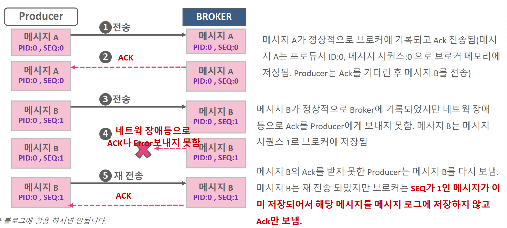

* Producer는 브로커로 부터 ACK를 받은 다음에 다음 메시지 전송하되, Producer ID와 메시지 Sequence를 Header에 저장하여 전송

* 메시지 Sequence는 메시지의 고유 Sequence번호. 0부터 시작하여 순차적으로 증가. Producer ID는 Producer가 기동시마다 새롭게 생성

* 브로커에서 메시지 Sequece가 중복 될 경우 이를 메시지 로그에 기록하지 않고 Ack만 전송.

* `브로커는 Producer가 보낸 메시지의 Sequence가 브로커가 가지고 있는 메시지의 Sequence보다 1만큼 큰 경우에만 브로커에 저장`


#### idempotence를 위한 producer 설정 방법

```java
Properties props = new Properties();
props.setProperty(ProducerConfig.BOOTSTRAP_SERVERS_CONFIG, "127.0.0.1:9092");
props.setProperty(ProducerConfig.KEY_SERIALIZER_CLASS_CONFIG, StringSerializer.class.getName());
props.setProperty(ProducerConfig.VALUE_SERIALIZER_CLASS_CONFIG, StringSerializer.class.getName());
props.setProperty(ProducerConfig.ACKS_CONFIG, "all");
props.setProperty(ProducerConfig.MAX_IN_FLIGHT_REQUESTS_PER_CONNECTION, "5");
//KafkaProducer object creation
KafkaProducer<String, String> kafkaProducer = new KafkaProducer<>(props);
```

> acks가 all이아니면 디폴트로 true여도 멱등적이게 설정되지 않는다. 

- enable.idempotence = true
- acks = all
- retries는 0보다큰 값
- max.in.flight.requests.per.connection은 1에서 5사이 값

dempotence 적용 후 성능이 약간 감소(최대 20%)할 수 있지만 기본적으로 idempotence 적용을 권장

* Kafka 3.0 버전 부터는 Producer의 기본 설정이 Idempotence 임.

* 하지만 기본 설정중에 enable.idempotence=true를 제외하고 다른 파라미터들을 잘못 설정하면(예를 들어 acks=1로 설정) Producer는 정상적으로 메시지를 보내지만 idempotence로는 동작하지 않음

* 명시적으로 enable.idempotence=true를 설정한 뒤 다른 파라미터들을 잘못 설정하면 Config 오류가 발생하면서 Producer가 기동되지 않음

#### idempotence 기반에서의 메시지 전송 순서 유지

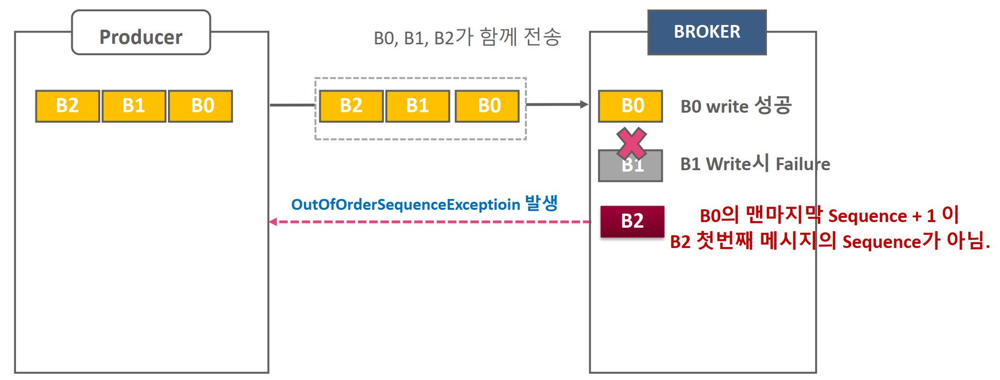

* B0이 가장 먼저, B1, B2 순에서 Producer에서 생성된 메시지 배치.

* Idempotence 기반에서 max.in.flight.requests.per.connection 만큼 여러 개의 배치들이 Broker에 전송됨.

* Broker는 메시지 배치를 처리시 write된 배치의 마지막 메시지 Sequence+1 이 아닌 배치 메시지가 올 경우OutoforderSequenceException을 생성하여 Producer에 오류로 전달.

* Idempotence(중복 없이 전송)은 Producer와 Broker간에 메시지 retry 시에만 중복 제거를 수행하는 메 커니즘
* 동일한 메시지를 send()로 두번 호출하여 전송하는 것은 Idempotence의 중복 제거 대상이 아님
* Producer가 재 기동되면 Producer ID가 달라지므로 이전 Producer가 전송한 메시지를 중복해서 보낼 수 있음.
* Consumer> Process-> Producer 로직에서 Consumer가 consumer_ofisets 에 읽은 offset을 저장하지 못하였지만 Producer는 메시지를 전송하였다면, Consumer는 이전 offset을 읽어서 Producer를 통해 중복된 메시지를 전송할 수 있음. Transaction 기반 처리 필요


### 전송방식 메커니즘 정리 및 주의사항

| 전송 모드         | 메시지 유실 | 중복 발생 | 구현 난이도     | 성능(오버헤드)            | 사용 사례                         |
| ----------------- | ----------- | --------- | --------------- | ------------------------- | --------------------------------- |
| **At Most Once**  | 가능        | 없음      | 낮음            | 가장 빠르고 간단          | 로그 등 일부 손실 허용 시         |
| **At Least Once** | 없음(거의)  | 가능      | 중간            | 일반적으로 우수           | 대부분의 애플리케이션 기본 모드   |
| **Exactly Once**  | 없음        | 없음      | 높음 (트랜잭션) | 트랜잭션 처리로 약간 하락 | 금융·결제 등 데이터 무결성 최우선 |

1. **At Most Once**
   - 빠르고 단순하지만 메시지 손실을 허용.
   - 소비자에서 “읽었다”는 오프셋 커밋을 처리보다 먼저 진행.
2. **At Least Once**
   - 메시지 손실은 방지하되, 중복은 발생 가능.
   - 장애 발생 시 메시지 재처리(중복).
   - 대부분의 카프카 환경에서 기본적으로 사용되는 방식.
3. **Exactly Once**
   - 메시지 손실도, 중복도 허용하지 않는 최상위 레벨 보장.
   - **Idempotent Producer** + **Transactions** + **read_committed Consumer** 필요.
   - 오버헤드(트랜잭션 관리, Coordinator 통신)로 인해 성능이 약간 떨어질 수 있음.

#### 장애 대응 및 운영 시 고려 사항

1. **Consumer 장애 시**
   - At Most Once: 이미 오프셋이 커밋되었을 수 있으므로 메시지 재처리 불가 → 손실 발생.
   - At Least Once: 장애 전 커밋되지 않은 메시지는 재처리 → 중복 가능.
   - Exactly Once: 트랜잭션 중이면 abort 후 재시도 (Kafka Streams나 Flink가 내부적으로 관리).
2. **Producer 장애 시**
   - At Most Once: 프로듀서 측에서 문제가 생겨도 별도 재시도 로직이 없으니 메시지 손실 가능.
   - At Least Once: 프로듀서 재시도 로직(acks 설정, retries, idempotent=false 시 중복 전송 가능).
   - Exactly Once: **Idempotent Producer** + **Transactional** 설정을 통해 중복/손실 방지.
3. **중복처리(Idempotency)**
   - At Least Once 시나리오에서, **데이터베이스나 어플리케이션에서 중복 삽입을 방지**하는 로직이 필요할 수 있음.
   - Exactly Once에서도 “카프카 내부”는 중복이 없게 처리해주지만, **카프카 밖(외부 DB, 다른 시스템)에 기록**할 때는 별도 보장 필요.
4. **트랜잭션 타임아웃**
   - Exactly Once를 사용하면, 트랜잭션 커밋 혹은 abort를 해야 하는 시간제한(트랜잭션 타임아웃)이 있다.
   - 장기간 오랜 시간 동안 열려 있는 트랜잭션은 브로커 리소스를 점유할 수 있으므로, **주기적으로 배치 사이즈나 타임아웃을 조절**해야 한다.

### Producer의 메시지 파티셔닝

```java
public interface Partitioner extends Configurable, Closeable {

    int partition(String topic, Object key, byte[] keyBytes, Object value, byte[] valueBytes, Cluster cluster);

    void close();

}

/**
 * 참고: 이 파티셔너는 더 이상 사용되지 않으며 사용해서는 안 됩니다.
 * 기본 파티셔닝 로직을 사용하려면 `partitioner.class` 설정을 제거하십시오.
 * Kafka 프로듀서 설정에서 partitioner.class를 명시적으로 설정하지 마세요.
 * Kafka는 자동으로 기본 파티셔너를 사용하여 메시지를 적절히 파티셔닝합니다.
 * 자세한 내용은 KIP-794를 참조하십시오.
 *
 * 기본 파티셔닝 전략:
 * <ul>
 * <li>레코드에 파티션이 지정된 경우, 해당 파티션을 사용
 * <li>파티션이 지정되지 않았지만 키가 있는 경우, 키의 해시 값을 기반으로 파티션 선택
 * <li>파티션과 키가 모두 없는 경우, 배치가 가득 찼을 때 변경되는 "스티키 파티션" 사용
 * 
 * 스티키 파티셔닝에 대한 자세한 내용은 KIP-480을 참조하십시오.
 */
@Deprecated
public class DefaultPartitioner implements Partitioner {

    private final StickyPartitionCache stickyPartitionCache = new StickyPartitionCache();

    public void configure(Map<String, ?> configs) {}

    public int partition(String topic, Object key, byte[] keyBytes, Object value, byte[] valueBytes, Cluster cluster) {
        return partition(topic, key, keyBytes, value, valueBytes, cluster, cluster.partitionsForTopic(topic).size());
    }

    public int partition(String topic, Object key, byte[] keyBytes, Object value, byte[] valueBytes, Cluster cluster,
                         int numPartitions) {
        if (keyBytes == null) {
            return stickyPartitionCache.partition(topic, cluster);
        }
        return BuiltInPartitioner.partitionForKey(keyBytes, numPartitions);
    }

    public void close() {}
    
    /**
     * 현재 스티키 파티션에서 배치가 완료된 경우, 스티키 파티션을 변경합니다.
     * 또는, 아직 스티키 파티션이 결정되지 않은 경우 새로 설정합니다.
     */
    @SuppressWarnings("deprecation")
    public void onNewBatch(String topic, Cluster cluster, int prevPartition) {
        stickyPartitionCache.nextPartition(topic, cluster, prevPartition);
    }
}
```

* KafkaProducer는 기본적으로 DefaultPartitioner 클래스를 이용하여 메시지 전송 시 도착할 Partition을 지정
* Defaultpartitioner는 키를 가지는 메시지의 경우 키 값을 Hashing하여 키 값에 따라 파티션 별로 균일하게 전송


Partitioner 인터페이스를 보면 직접 구현할 수 있다.

직접 구현해서 프로듀서에

```
props.put("partitioner.class", "com.example.CustomPartitioner");
```

하면 된다.