# 섹션5

## java 기반 컨슈머 구현 실습 및 consumer 내부 메커니즘 이해

브로커의 Topic 메시지를 읽는 역할을 수행.

모든 Consumer들은 고유한 그룹아이디 group.id를 가지는 Consumer Group에 소속되어야 함.

개별 Consumer Group 내에서 여러 개의 Consumer 들은 토픽 파티션 별로 분배됨.

```java
public class SimpleConsumer {

    public static final Logger logger = LoggerFactory.getLogger(SimpleConsumer.class.getName());

    public static void main(String[] args) {
        logger.atLevel(org.slf4j.event.Level.INFO);
        String topicName = "simple-topic";

        Properties props = new Properties();
        props.setProperty(ConsumerConfig.BOOTSTRAP_SERVERS_CONFIG, "127.0.0.1:9092");
        props.setProperty(ConsumerConfig.KEY_DESERIALIZER_CLASS_CONFIG, StringDeserializer.class.getName());
        props.setProperty(ConsumerConfig.VALUE_DESERIALIZER_CLASS_CONFIG, StringDeserializer.class.getName());
        props.setProperty(ConsumerConfig.GROUP_ID_CONFIG, "group-01");


        KafkaConsumer<String, String> kafkaConsumer = new KafkaConsumer<String, String>(props);

		try (kafkaConsumer) {
			kafkaConsumer.subscribe(List.of(topicName));
			while (true) {
				ConsumerRecords<String, String> consumerRecords = kafkaConsumer.poll(Duration.ofMillis(1000));
				for (ConsumerRecord record : consumerRecords) {
					logger.info("record key:{}, record value:{}, partition:{}", record.key(), record.value(), record.partition());
				}
				kafkaConsumer.commitSync();
			}
		}

    }
}
```


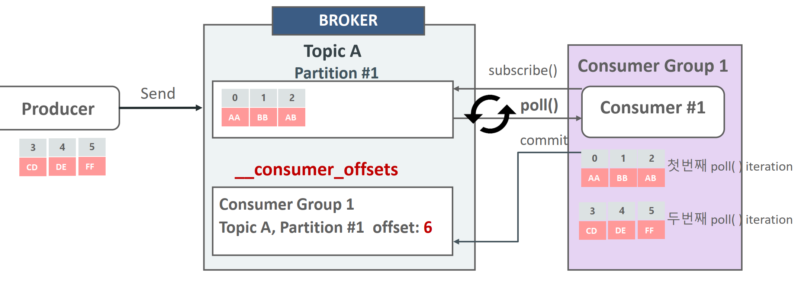

Consumer는 poll() 메소드를 이용하여 주기적으로 브로커의 토픽 파티션에서 메시지를 가져옴.

메시지를 성공적으로 가져왔으면 commit을 통해서 _consumer_offse에 다음에 읽을 offset 위치를 기재함.

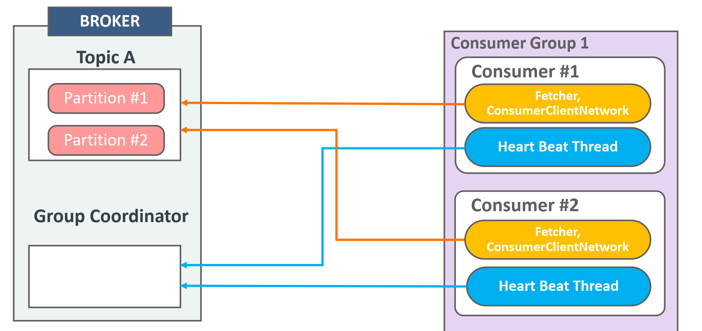

* kafkaConsumer는 Fetcher, ConsumerClientNetwork등의 주요 내부 객체와 별도의 Heart Beat Thread를 생성

* Fetch, ConsumerClientNetwork 객체는 Broker의 토픽 파티션에서 메시지를 Fetch 및 Poll 수행

* **Heart Beat Thread**는 Consumer의 정상적인 활동을 **Group Coordinator**에 보고하는 역할을 수행
  * (Group Coordinator는 주어진 시간동안 Heart Beat을 받지 못하면 Consumer들의 Rebalance를 수행 명령)

### consumer subscribe, poll, commit

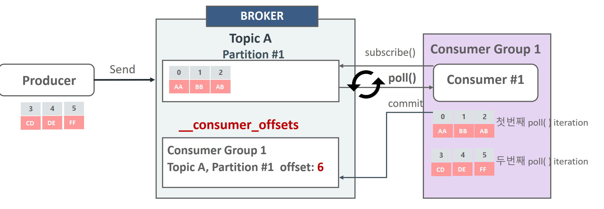

Consumer는 subscribe()를 호출하여 읽어 들이려는 토픽을 등록.

Consumer는 poll() 메소드를 이용하여 주기적으로 브로커의 토픽 파티션에서 메시지를 가져옴.

메시지를 성공적으로 가져 왔으면 commit을 통해서 _consumer_offse에 다음에 읽을 offset 위치를 기재함.

* Kafka는 오프셋이 선형적으로 증가하는 것을 보장하며, 오프셋 순서를 건너뛰는 폴링은 지원하지 않는다. 
* 컨슈머에서 `seek` 메서드를 사용해 강제로 **2번 메시지의 오프셋**으로 이동하면, 다음번 메시지를 가져올 수 있긴 하다.


### consumer api

1. Consumer 환경 설정(Properties 객체를 이용)

2. 1에서 설정한 환경 설정값을 반영하여 KafkaConsumer 객체 생성.

3. 읽어들일 Topic을 subscribe()를 호출하여 설정

4. 지속적으로 pol() 을 호출하여 Topic의 새로운 메시지를 계속 읽어 들임.

5. KafkaConsumer객체를 명확하게 close() 수행

컨슈머의 구성요소

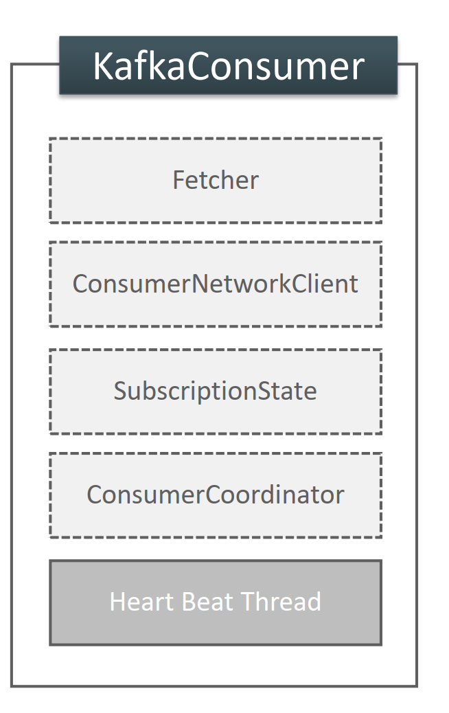

* 조회하는 패처, 네트워크 클라이언트, 구독 상태, 쿠디네이터, 하트비트 스레드로 구성
  * **Fetcher (패처)**
    - 역할
      - Kafka 브로커에서 메시지를 가져오는 역할.
      - 메시지 요청(`fetch`)을 처리하며, 데이터 압축 해제 등도 수행.
  * **NetworkClient (네트워크 클라이언트)**
    - 역할
      - Kafka 브로커와의 모든 네트워크 통신을 담당.
      - 데이터 요청(패치), 메타데이터 요청, 하트비트 전송 등을 관리.
      - 비동기 I/O로 구현.
  * **SubscriptionState (섭스크립션 상태)**
    - 역할
      - 컨슈머가 구독한 토픽/파티션의 상태를 추적.
      - 현재 읽고 있는 오프셋 및 커밋된 오프셋을 관리.
      - 리밸런싱 중인지 여부 등을 저장.
  * **ConsumerCoordinator (컨슈머 코디네이터)**
    - 역할
      - 컨슈머 그룹 내 조정을 담당.
      - 리밸런싱 처리 및 파티션 할당 관리.
      - 오프셋 커밋과 연동.
  * **Heartbeat Manager (하트비트 매니저)**
    - 역할
      - 컨슈머가 활성 상태임을 Kafka 브로커에 알림.
      - 설정된 주기(`heartbeat.interval.ms`)로 하트비트를 전송.
      - 하트비트 누락 시 `session.timeout.ms`에 따라 리밸런싱 트리거.
  * **Metadata (메타데이터)**
    - 역할
      - Kafka 클러스터의 정보(토픽, 파티션, 브로커 리더 등)를 유지.
      - 변경 사항 발생 시 동기화.
  * **Offset Commit Manager (오프셋 커밋 매니저)**
    - 역할
      - 처리 완료된 메시지의 오프셋을 Kafka 브로커에 커밋.
      - 수동(`commitSync`) 또는 자동(`enable.auto.commit=true`)으로 동작.
  * **Rebalance Listener (리밸런스 리스너)**
    - 역할
      - 리밸런싱 이벤트 발생 시 사용자 정의 작업을 수행.
      - `onPartitionsRevoked`와 `onPartitionsAssigned` 콜백을 제공.
  * **Background Threads (백그라운드 스레드)**
    - 역할 : 데이터 패치, 하트비트 전송, 재시도 등을 비동기적으로 처리.

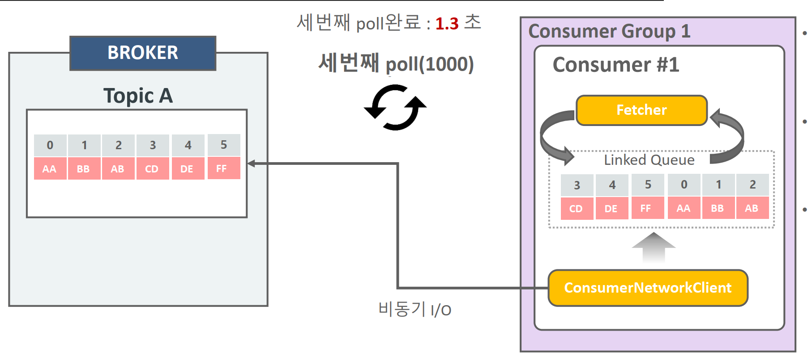

위 그림은 패쳐의 프로세스

- Linked Queue에 데이터가 있을 경우 Fetcher는 데이터를 가져오고 반환 하며 poll() 수행 완료
- ConsumerNetworkClient는 비동기로 계속 브로커의 메시지를 가져와서 Linked Queue에 저장
  - 내부적으로 BlockingQueue를 가지고 있음. 
- Linked Queue에 데이터가 없을 경우 1000ms 까지 Broker에 메시지 요청 후 poll 수행() 완료

```java
// in AsynckafkaConsumer
/**
 * "{@link FetchCollector#collectFetch(FetchBuffer) fetch collection}" 단계를 수행합니다.
 * 이 단계에서는 {@link #fetchBuffer}에서 원시 데이터를 읽어와 적절한 형식의 {@link CompletedFetch}로 변환하고,
 * 해당 데이터와 내부 {@link SubscriptionState 상태}가 올바른지 검증한 뒤,
 * 모든 데이터를 {@link Fetch}로 변환하여 반환합니다.
 *
 * <p/>
 *
 * 이 메서드는 반환하기 전에 {@link ConsumerNetworkThread#wakeup() 네트워크 스레드를 깨웁니다}.
 * 이는 <em>다음 데이터를 미리 가져올 수 있도록</em> 최적화를 위한 작업입니다.
 */
private Fetch<K, V> collectFetch() {
    final Fetch<K, V> fetch = fetchCollector.collectFetch(fetchBuffer);

    // Notify the network thread to wake up and start the next round of fetching.
    applicationEventHandler.wakeupNetworkThread();

    return fetch;
}

```


*  Fetcher는 Linked Queue 데이터를 가져오되, Linked Queue에 데이터가 없을 경우 ConsumerNetworkClient 에서 데이터를 브로커로 부터 가져올 것을 요청

#### 컨슈머 패처 관련 주요 설정 파라미터

* fetch.min.bytes
  * Fetcher가 record들을 읽어들이는 최소 bytes. 브로커는 지정된 fetch.min.bytes 이상의 새로운 메시지가 쌓일때 까지 전송을 하지 않음. 기본은 1이며 예시 설정은 `1024` (1KB)
  * 작은 값: 낮은 대기 시간(즉각 응답). 큰 값: 대기 후 더 많은 메시지를 가져옴(대역폭 최적화).
  * 이 크기가 다차면 fetch.max.wait.ms 를 기다리지 않고 바로 보냄. 
* fetch.max.bytes
  * fetcher가 한번에 가져올 수 있는 최대 데이터 bytes. 기본은 50MB

* fetch.max.wait.ms
  * 브로커에 fetch.min.bytes 이상의 메시지가 쌓일 때까지 최대 대기 시간. 기본은 500ms
    * 설정된 시간 안에 데이터가 준비되지 않으면, 현재 가능한 데이터를 반환.

* max.partition.fetch.bytes : 파티션별 한번에 최대로 가져올 수 있는 바이트
* max.poll.records
  * poll()로 한번에 가져올 수 있는 레코드 수. 기본은 500
  * 메시지 처리 시간이 긴 경우 작은 값(예: `10`)을 설정.

정리하자면,

브로커가 **`fetch.min.bytes` 이상의 데이터를 준비**한 경우, **`fetch.max.wait.ms`를 기다리지 않고** 데이터를 즉시 전송

반대로, `fetch.max.wait.ms`가 초과되더라도 **현재 준비된 데이터**를 전송.이 경우 데이터 크기가 `fetch.min.bytes`를 충족하지 못하더라도 전송

### **주요 상관관계**

- `fetch.min.bytes` vs. `fetch.max.wait.ms`
  - 데이터 크기가 `fetch.min.bytes`를 충족하면 대기 없이 바로 전송.
  - 준비된 데이터가 적으면 `fetch.max.wait.ms`까지 기다림.
- `fetch.max.bytes` vs. `fetch.min.bytes`
  - `fetch.max.bytes`가 더 우선 적용되어, `fetch.min.bytes`를 충족하더라도 초과된 데이터는 잘려 나감.
- `max.partition.fetch.bytes` vs. `fetch.max.bytes`
  - 각 파티션 제한이 우선 적용되며, 총합이 `fetch.max.bytes`를 초과하지 않음.
- `max.poll.records` vs. 데이터 크기 옵션
  - 크기(`fetch.min.bytes`, `fetch.max.bytes`)와 상관없이 최대 레코드 수(`max.poll.records`)로 데이터를 제한.

예시

```
fetch.min.bytes = 16384
fetch.max.wait.ms = 500
fetch.max.bytes = 52428800
max.partition.fetch.bytes=1024168
max.poll.records = 500
```

- 가져올 데이터가 1건도 없으면 poll() 인자 시간만큼 대기 후 Return
- 가져와야할 과거 데이터가 많을 경우 max.partition.fetch.bytes로 배치 크기 설정.
    그렇지 않을 경우 fetch.min.bytes로 배치 크기 설정
- 가장 최신의 offset 데이터를 가져오고 있다면 fetch.min.bytes 만큼 가져오고 return 하고 fetch.min bytes만큼 쌓이지 않는다면 fetch.max.wait.ms 만큼 기다린 후 return
- 오랜 과거 offset 데이터를 가져 온다면 최대 max.partition.fetch.bytes 만큼 파티션 에서 읽은 뒤 반환
- max.partition.feth.bytes에 도달하지 못하여도 가장 최신의 offset에 도달하면 반환
- 토픽에 파티션이 많아도 가져오는 데이터량은 fetch.max.bytes로 제한
- Fetcher가 Linked Queue에서 가져오는 레코드의 개수는 max.poll.records로 제한

### 컨슈머 안전하게 종료하기 - wakeup

`KafkaConsumer`의 `wakeup()` 메서드는 Kafka 컨슈머가 실행 중인 스레드에서 안전하게 작업을 중단하고 종료할 수 있도록 설계된 메서드. 일반적으로 Kafka 컨슈머는 `poll()` 메서드 호출을 통해 데이터를 가져오며, 이 작업은 블로킹 상태가 될 수 있다. 이때 `wakeup()` 메서드를 호출하면 블로킹 상태를 해제하고 `WakeupException`을 던지게딘다. 

```java
public class ConsumerWakeupV2 {

	public static final Logger logger = LoggerFactory.getLogger(ConsumerWakeupV2.class.getName());

	public static void main(String[] args) {

		String topicName = "pizza-topic";

		Properties props = new Properties();
		props.setProperty(ConsumerConfig.BOOTSTRAP_SERVERS_CONFIG, "127.0.0.1:9092");
		props.setProperty(ConsumerConfig.KEY_DESERIALIZER_CLASS_CONFIG, StringDeserializer.class.getName());
		props.setProperty(ConsumerConfig.VALUE_DESERIALIZER_CLASS_CONFIG, StringDeserializer.class.getName());
		props.setProperty(ConsumerConfig.GROUP_ID_CONFIG, "group_02");
		props.setProperty(ConsumerConfig.MAX_POLL_INTERVAL_MS_CONFIG, "60000");

		KafkaConsumer<String, String> kafkaConsumer = new KafkaConsumer<String, String>(props);
		kafkaConsumer.subscribe(List.of(topicName));

		//main thread
		Thread mainThread = Thread.currentThread();

		//main thread 종료시 별도의 thread로 KafkaConsumer wakeup()메소드를 호출하게 함.
		Runtime.getRuntime()
			.addShutdownHook(new Thread(() -> {
				logger.info(" main program starts to exit by calling wakeup");
				kafkaConsumer.wakeup();

				try {
					mainThread.join();
				} catch (InterruptedException e) {
					e.printStackTrace();
				}
			}));

		int loopCnt = 0;

		try {
			while (true) {
				ConsumerRecords<String, String> consumerRecords = kafkaConsumer.poll(Duration.ofMillis(1000));
				logger.info(" ######## loopCnt: {} consumerRecords count:{}", loopCnt++, consumerRecords.count());
				for (ConsumerRecord record : consumerRecords) {
					logger.info("record key:{},  partition:{}, record offset:{} record value:{}",
						record.key(), record.partition(), record.offset(), record.value());
				}
				try {
					logger.info("main thread is sleeping {} ms during while loop", loopCnt * 10000);
					Thread.sleep(loopCnt * 10000);
				} catch (InterruptedException e) {
					e.printStackTrace();
				}
			}
		} catch (WakeupException e) {
			logger.error("wakeup exception has been called");
		} finally {
			logger.info("finally consumer is closing");
			kafkaConsumer.close();
		}

		//kafkaConsumer.close();

	}
}
```


### 컨슈머의 auto.offset.reset

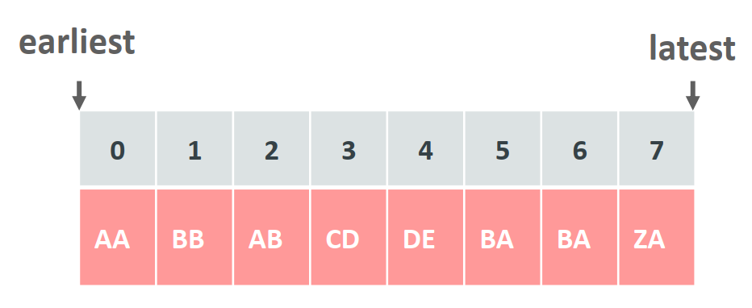

* consumer_offsets에 Consumer Group이 해당 Topic Partition 별로 offset 정보를 가지고 있지 않을 시 Consumer가 접속 시 해당 파티션의 처음 offset 부터(earliest) 가져올 것인지, 마지막 ofiset 이후 부터 가져올 것인지를 설정하는 파라미터

  * auto.offset.reset = earliest: 처음 오프셋부터 읽음 
  * auto.offset.reset = latest: 마지막 오프셋부터 읽음(토픽 컨슈머 그룹의)

* 동일 consumer Group으로 Consumer가 새롭게 접속할 시 consumer_ofisets에 있는 Offset 정보를 기반으로 메시지를 가져오기 때문에 earliest로 설정하여도 0번 오프셋 부터 읽어 들이지 않음.

* Consumer Group의 Consumer가 모두 종료 되어도 Consumer Group이 읽어들인 ofset 정보는 **7일동안 consumer_ofisets에 저장되어 있음**

  (offsets.retention.minutes)

* 해당 Topic이 삭제되고 재 생성될 경우에는 해당 topic에 대한 Consumer Group의 offset 정보는 0으로 _consumer_offsets으로 기록됨

### broker의 Group Coordinator와 Consumer/ConsumerGroup

Consumer Group내에 

* 새로운 Consumer가 추가되거나 
* 기존 Consumer가 종료 될 때, 
* Topic에 새로운 Partition이 추가될 때 

Broker의 Group Coordinator는 Consumer Group내의 Consumer들에게 파티션을 재 할당하는 **Rebalancing**을 수행하도록 지시

* Group Coordinator는 컨슈머들의 joinGroup 정보, 파티션 매핑정보, HeartBeat 관리

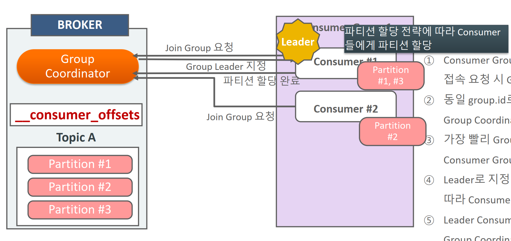

1. Consumer Group내의 Consumer가 브로커에 최초 접속 요청 시 Group Coordinator 생성.

2. 동일 group.id로 여러 개의 Consumer로 Broker의 Group Coordinator로 접속

3. 가장 빨리 Group에 Join 요청을 한 Consumer에게Consumer Group 내의 Leader Consumer로 지정 
4. Leader로 지정된 Consumer는 파티션 할당전략에 따라 Consumer들에게 파티션 할당

5. Leader Consumer는 최종 할당된 파티션 정보를 Group Coordinator에게 전달.

6. 정보 전달 성공을 공유한 뒤 개별 Consumer들은 할당된 파티션에서 메시지 읽음

### 컨슈머 리밸런싱 (Rebalancing)

Consumer Group내에 

* 새로운 Consumer가 추가되거나 
* 기존 Consumer가 종료 될 때, 
* Topic에 새로운 Partition이 추가될 때 

Broker의 Group Coordinator는 Consumer Group내의 Consumer들에게 파티션을 재 할당하는 **Rebalancing**을 수행하도록 지시

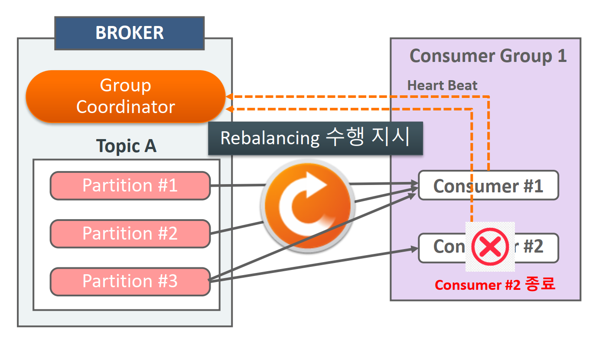

**리밸런싱 과정**

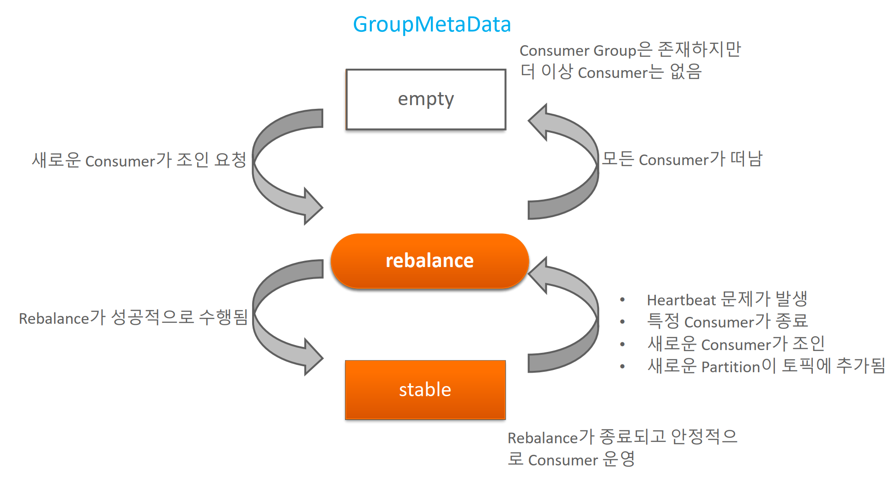

1. **Coordinator가 리밸런싱 트리거**
   - 컨슈머 그룹 리더(Coordinator)가 리밸런싱을 감지하고 트리거를 발생시킴
2. **Stop the World 단계**
   - 기존 컨슈머는 메시지를 처리하지 않고 **Rebalance 상태**로 들어감.
   - 이 단계 동안 메시지 처리의 일시적 중단이 발생할 수 있다.
3. **파티션 재배치**
   - Kafka는 컨슈머들에게 새로운 파티션을 할당.
   - 새로 할당된 파티션은 이전 컨슈머가 처리 중이던 오프셋 위치부터 처리. (중복 주의)
4. **컨슈머 그룹 안정화**
   - 모든 컨슈머가 새로운 파티션 할당 정보를 수락하면 리밸런싱이 완료.

### 컨슈머의 스태틱 그룹 멤버십의 필요성

컨슈머는 **스태틱 멤버 ID(Static Member ID)**를 제공하면서 그룹에 참여하는 방식이다. 

기존 Kafka의 컨슈머 그룹은 **동적 그룹 멤버십(Dynamic Group Membership)**을 사용한다. 

이는 컨슈머가 그룹에 참여하거나 떠날 때마다 **리밸런싱(Rebalancing)**이 발생하도록 설계되어있어 단점이 잇다.

- 많은 Consumer를 가지는 Consumer Group에서 Rebalance가 발생하면 모든 Consumer들이 Rebalance
    를 수행하므로 많은 시간이 소모 되고 대량 데이터 처리시 Lag가 더 길어질 수 있음
- 유지보수 차원의 Consumer Restart도 Rebalance를 초래하므로 불필요한 Rebalance를 발생 시키지 않 을 방법 대두

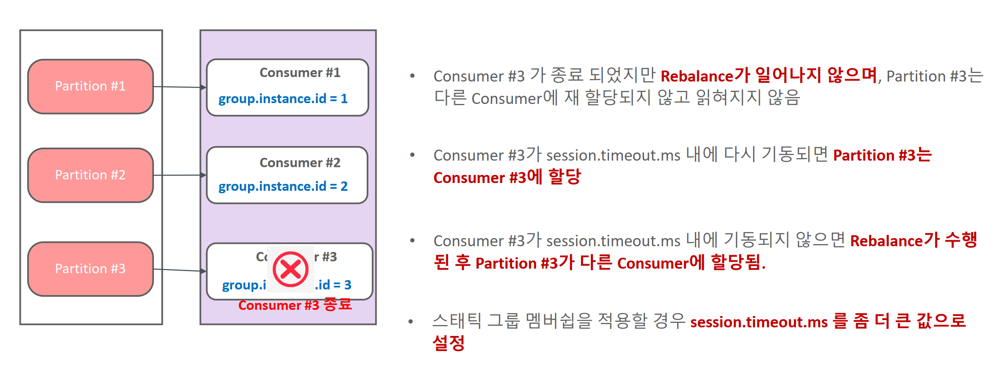

- Consumer Group내의 Consumer들에게 고정된 id를 부여.
- Consumer 별로 Consumer Group 최초 조인 시 할당된 파티션을 그대로 유지하고 Consumer가 shutdown되어도 session.timeout.ms내에 재 기동되면 rebalance가 수행되지 않고, 기존 파티션이 재 할당됨.

**필요성**

**리밸런싱 비용 감소**

- 동적 그룹 멤버십에서는 컨슈머가 일시적으로 네트워크 장애나 세션 타임아웃으로 인해 그룹을 떠났다고 간주될 때, 모든 파티션이 리밸런싱된다..
- 스태틱 멤버십은 컨슈머가 동일한 멤버 ID를 유지하므로, 네트워크 장애나 잠깐의 연결 끊김에도 불구하고 리밸런싱을 방지할 수 있다.

**컨슈머 안정성 향상**

- 동일한 컨슈머가 동일한 파티션을 지속적으로 처리할 수 있으므로 메시지 처리의 일관성이 유지된다.

**대규모 컨슈머 그룹에서의 효율성**

- 리밸런싱 비용은 컨슈머 그룹이 클수록 증가합니다. 스태틱 멤버십은 리밸런싱 횟수를 줄여 성능 저하를 방지한다.

**저지연 응용**

- 메시지 처리 중단 시간을 최소화해야 하는 실시간 애플리케이션에서 특히 유용하다.

### **스태틱 그룹 멤버십의 동작 방식**

1. 컨슈머는 **스태틱 멤버 ID(Static Member ID)**를 제공하면서 그룹에 참여
2. 그룹 코디네이터는 이 ID를 기반으로 컨슈머를 그룹에 등록
3. 만약 컨슈머가 잠시 네트워크에서 연결이 끊겨도, 동일한 멤버 ID를 사용하여 재연결하면 리밸런싱 없이 다시 그룹에 합류

#### **스태틱 그룹 멤버십 관리 방법**

#### **1. Kafka 클라이언트 설정**

Kafka 컨슈머에서 스태틱 그룹 멤버십을 활성화하려면 `group.instance.id`를 설정해야 한다.
이 ID는 컨슈머를 고유하게 식별하는 역할을 한다. 

```java
Properties props = new Properties();
props.put("bootstrap.servers", "localhost:9092");
props.put("group.id", "my-consumer-group");
props.put("group.instance.id", "consumer-instance-1"); // 스태틱 멤버 ID
props.put("enable.auto.commit", "true");
props.put("key.deserializer", "org.apache.kafka.common.serialization.StringDeserializer");
props.put("value.deserializer", "org.apache.kafka.common.serialization.StringDeserializer");

KafkaConsumer<String, String> consumer = new KafkaConsumer<>(props);
```

#### **2. 운영 중 스태틱 멤버 ID 관리**

- **고유한 ID**: 각 컨슈머 인스턴스에 대해 고유한 `group.instance.id`를 할당해야 한다.
- **ID 변경 금지**: 스태틱 멤버십은 ID를 기반으로 작동하므로, 애플리케이션 배포 시에도 동일한 ID를 유지해야 한다.

#### **3. 세션 타임아웃 설정 최적화**

스태틱 멤버십을 사용하는 경우, 타임아웃 값(`session.timeout.ms`, `heartbeat.interval.ms`)을 적절히 설정하여 네트워크 끊김으로 인한 그룹 탈퇴를 방지해야한다. 

```
props.put("session.timeout.ms", "30000");
props.put("heartbeat.interval.ms", "10000");
```

#### **4. 리밸런싱 조정**

스태틱 멤버십을 사용해도 리밸런싱이 필요한 경우를 대비해 `partition.assignment.strategy`를 적절히 선택한다. 예를 들어, "StickyAssignor"를 사용하면 파티션 변경을 최소화할 수 있다.

```
props.put("partition.assignment.strategy", "org.apache.kafka.clients.consumer.StickyAssignor");
```

------

### **장점**

1. **리밸런싱 방지**: 연결 끊김에도 리밸런싱을 방지하여 메시지 처리 중단 최소화.
2. **리소스 절약**: 리밸런싱에 필요한 네트워크 및 시스템 리소스 절감.
3. **메시지 처리 일관성**: 동일한 컨슈머가 동일한 파티션을 지속적으로 처리.

### **단점**

1. **ID 관리의 복잡성**: 각 컨슈머에 고유한 ID를 부여하고 유지해야 함.
2. **잘못된 ID 설정 위험**: 잘못된 `group.instance.id` 설정 시 예기치 않은 동작 발생 가능.

### Kafka Consumer의 Heart Beat Thread

H eart Beat Thread를 통해서 브로커의 Group Coordinator에 Consumer의 상태를 전송하는 백그라운드 스레드이다 

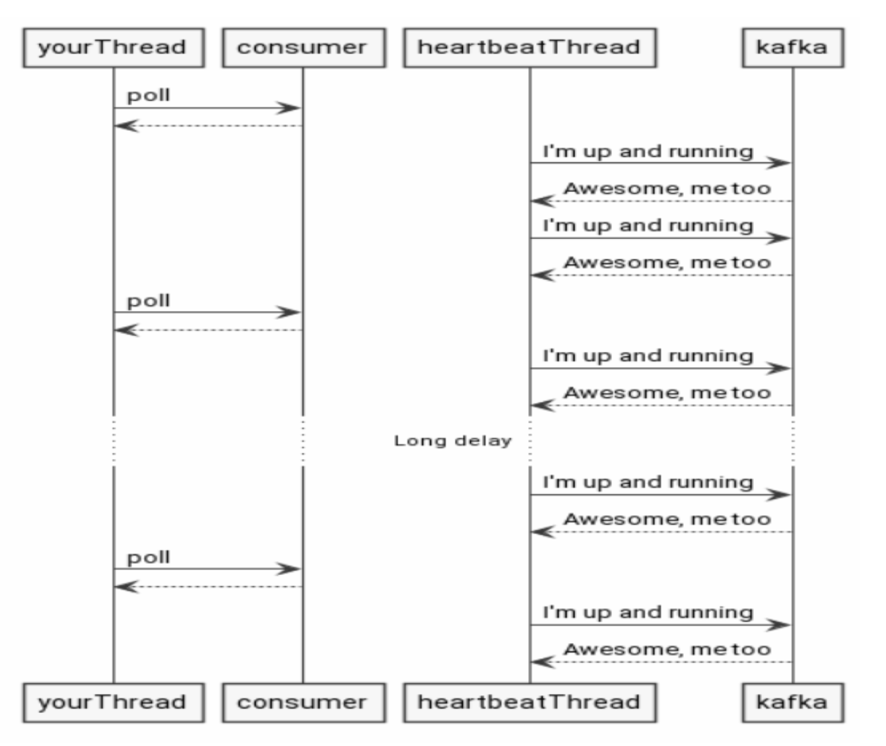

* 다이어그램상 브로커와 허트비트 스레드가 통신하고 있는것이 보임. 
* 다이어그램 가운데 부분의 ‘Long delay’는 **poll() 호출이 한동안 일어나지 않는 상황**을 가정한 것.
* 하트비트 스레드는 계속해서 브로커와 통신할 수 있으므로, **세션 타임아웃(session.timeout.ms)** 이내라면 그룹에서 탈퇴되지 않는다.
* 하지만 **`max.poll.interval.ms`** 를 초과해서 오랫동안 `poll()`을 호출하지 않으면, 결국 컨슈머 그룹에서 해당 컨슈머를 ‘멈췄다’고 판단하여 **리밸런싱**이 일어날 수 있다.

**Kafka Consumer 관련 주요 파라미터 표**

| **파라미터명**              | **기본값 (ms)** | **설명**                                                     |
| --------------------------- | --------------- | ------------------------------------------------------------ |
| **`heartbeat.interval.ms`** | 3000            | Heartbeat 스레드가 브로커로 Heartbeat을 보내는 간격. `session.timeout.ms`보다 낮아야 하며, 일반적으로 `session.timeout.ms`의 1/3 이하로 설정 권장. |
| **`session.timeout.ms`**    | 45000           | 브로커가 컨슈머의 Heartbeat을 기다리는 최대 시간. 이 시간 동안 Heartbeat을 받지 못하면 해당 컨슈머를 그룹에서 제외하고 리밸런싱을 트리거. |
| **`max.poll.interval.ms`**  | 300000          | 이전 `poll()` 호출 이후 다음 호출까지 브로커가 기다리는 최대 시간. 이 시간이 초과되면 브로커는 컨슈머가 문제가 있다고 판단하고 리밸런싱을 트리거. |

```java
while (true) {
	ConsumerRecords<String, String> consumerRecords = kafkaConsumer.poll(Duration.ofMillis(1000));
	for (ConsumerRecord record : consumerRecords) {
		logger.info("record key:{}, record value:{}, partition:{}", record.key(), record.value(), record.partition());
	}
}
```

* poll() 호출 간격이 max.poll.interval.ms를 넘으면 리밸런스가 수행되므로 주의해야 한다 

### 컨슈머 리밸런싱 프로토콜 

**Eager Rebalancing**과 **Cooperative Rebalancing** 두가지가 있다.

#### Eager 프로토콜

Eager Rebalancing은 Kafka의 초기 리밸런싱 프로토콜로, 전통적으로 사용되던 방식

- Rebalance 수행 시 기존 Consumer들의 모든 파티션 할당을 취소하고 잠시 메시지를 읽지 않음. 이후 새롭게 Consumer에 파티션 을 다시 할당 받고 다시 메시지를 읽음.
- 모든 Consumer가 잠시 메시지를 읽지 않는 시간으로 인해 Lag가 상대적으로 크게 발생할 가능성 있음.

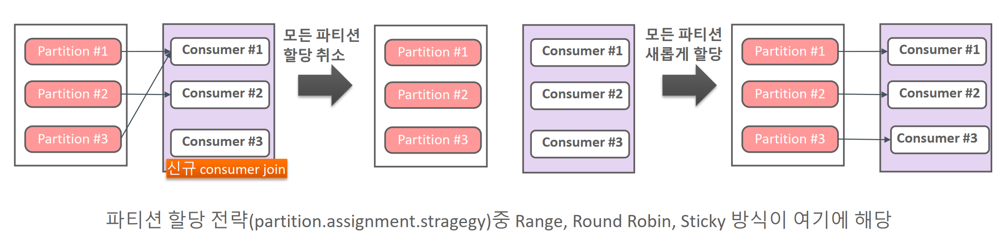

작동방식

* 리밸런싱이 트리거되면 **모든 컨슈머가 자신이 맡고 있던 파티션을 반환**.
* 이후, 그룹의 리더가 새로운 파티션 분배 계획을 수립하고 모든 컨슈머에게 다시 할당.
* 즉, 모든 파티션이 한 번에 **"중지 → 재분배 → 재시작"** 단계를 거침 

장단점

* 장점 : 간단함.
* 단점 : 스탑더월드문제 -> 리밸런싱 중 모든 컨슈머가 작업을 멈추기 때문에 처리량에 영향을 미치며, 그룹이 클수록 리밸런싱 시간이 길어짐

#### Incremental Cooperative 모드 (점진적 협업 )

Cooperative Rebalancing은 Kafka 2.4에서 도입된 새로운 리밸런싱 프로토콜로, Incremental Cooperative Rebalancing이라고도 함.

* Rebalance 수행 시 기존 Consumer들의 모든 파티션 할당을 취소하지 않고 대상이 되는 Consumer들에 대해서 파티션에 따라 점진적으로(Incremental) Consumer를 할당하면서 Rebalance를 수행.

* 전체 Consumer가 메시지 읽기를 중지하지 않으며 개별 Consumer가 협력적으로(Cooperative) 영향을 받는 파티션만 Rebalance로 재 분배. 많은 Consumer를 가지는 Consumer Group내에서 Rebalance 시간이 오래 걸릴 시 활용도 높음

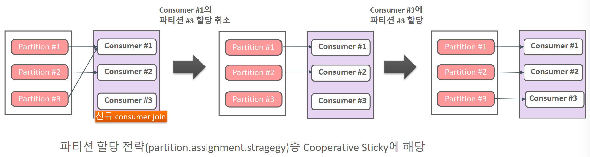

작동 방식

- 리밸런싱이 트리거되더라도 모든 컨슈머가 즉시 자신이 맡은 파티션을 반환하지 않음.
- 대신, 컨슈머는 단계적으로 파티션을 반환하고, 필요한 파티션만 새롭게 할당는다.
  1. 기존에 맡고 있던 파티션을 계속 처리.
  2. 새로운 파티션만 추가로 할당받거나, 반환할 파티션만 반환.
  3. 모든 작업이 완료되면 리밸런싱 종료.

장/단점

* 장점 : 무중단 처리. 리밸런싱 중에도 대부분의 파티션은 처리 가능하며  변경이 필요한 부분만 조정하여 리밸런싱 속도가 빨라짐.
* 단점 : Eager 방식보다 프로토콜이 복잡하며, 설정 및 관리가 더 어려울 수 있음.

**Eager vs Cooperative 비교**

| 특징                   | **Eager Rebalancing**    | **Cooperative Rebalancing**   |
| ---------------------- | ------------------------ | ----------------------------- |
| **파티션 반환**        | 모든 파티션 반환         | 필요한 파티션만 반환          |
| **리밸런싱 중단 시간** | 상대적으로 길다          | 매우 짧다                     |
| **처리 중단 가능성**   | 높다                     | 낮다                          |
| **적합한 환경**        | 소규모 그룹, 간단한 설정 | 대규모 그룹, 높은 가용성 요구 |

```java
consumer.properties 파일 설정 
# Eager 방식 (기본값)
partition.assignment.strategy=org.apache.kafka.clients.consumer.RangeAssignor

# Cooperative 방식
partition.assignment.strategy=org.apache.kafka.clients.consumer.CooperativeStickyAssignor


-----------------------------------------------------------------
자바 설정
Properties props = new Properties();
props.put(ConsumerConfig.BOOTSTRAP_SERVERS_CONFIG, "localhost:9092");
props.put(ConsumerConfig.GROUP_ID_CONFIG, "my-group");
props.put(ConsumerConfig.KEY_DESERIALIZER_CLASS_CONFIG, "org.apache.kafka.common.serialization.StringDeserializer");
props.put(ConsumerConfig.VALUE_DESERIALIZER_CLASS_CONFIG, "org.apache.kafka.common.serialization.StringDeserializer");

// Cooperative Rebalancing 설정
props.put(ConsumerConfig.PARTITION_ASSIGNMENT_STRATEGY_CONFIG, 
    "org.apache.kafka.clients.consumer.CooperativeStickyAssignor");

// Consumer 생성
KafkaConsumer<String, String> consumer = new KafkaConsumer<>(props);
```

### **리밸런싱 전략 옵션**( 파티션 할당 전략)

Kafka는 다음과 같은 리밸런싱 전략(Partition Assignor)을 제공

| **Partition Assignor**      | **설명**                                                     |
| --------------------------- | ------------------------------------------------------------ |
| `RangeAssignor`             | **Eager 방식**: 토픽별로 파티션을 연속된 범위로 할당. 기본값<br />* - 서로 다른 2개 이상의 토픽을 Consumer들이 Subscription 할 시 토픽별 동일한 파티션을 특정 Consumer에게 할당하는 전략.<br /> 여러 토픽들에서 동일한  **키값**으로 되어 있는 파티션은 특정 Consumer에 할당하여 해당 Consumer가 여러 토픽의 동일 키값으로 데이터 처리를 용이하게 할 수 있도록 지원. |
| `RoundRobinAssignor`        | **Eager 방식**: 모든 파티션을 순환적으로 할당.<br />파티션별로 Consumer들이 균등하게 부하를 분배할 수 있도록 여러 토픽들의 파티션들을 Consumer들에게 순차적인 Round robin 방식으로 할당. |
| `StickyAssignor`            | **Eager 방식**: 이전 할당을 최대한 유지하며, 최소한의 변경으로 리밸런싱.<br />최초에 할당된 파티션과 Consumer 매핑을 Rebalance 수행되어도 가급적 그대로 유지할 수 있도록 지원하는 전략.<br />하지만 Eager Protocol 기반이므로 Rebalance 시 모든 Consumer의 파티션 매핑이 해제된 후에 다시 매핑되는 형태임. |
| `CooperativeStickyAssignor` | **Cooperative 방식**: Incremental Cooperative Rebalancing을 지원.<br /> 최초에 할당된 파티션과 Consumer 매핑을 Rebalance 수행되어도 가급적 그대로 유지할 수 있도록 지원.<br /> Cooperative Protocol 기반으로 Rebalance 시 모든 Consumer의 파티션 매핑이 해제되지 않고 Rebalance 연관된 파티션과 Consumer만 재매핑됨. |

# 섹션7 컨슈머 내부 메커니즘

## 컨슈머 Offset 커밋

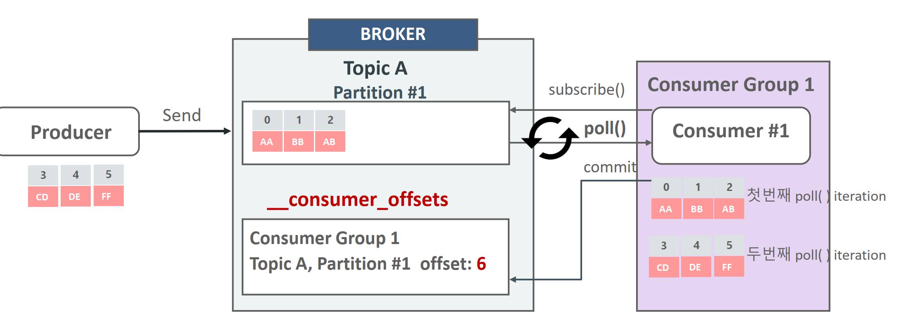

Consumer는 subscribe()를 호출하여 읽어 들이려는 토픽을 등록.

Consumer는 poll() 메소드를 이용하여 주기적으로 브로커의 토픽 파티션에서 메시지를 가져옴.

메시지를 성공적으로 가져 왔으면 commit을 통해서 consumer_ofise에 다음에 읽을 ofiset 위치를 기재함

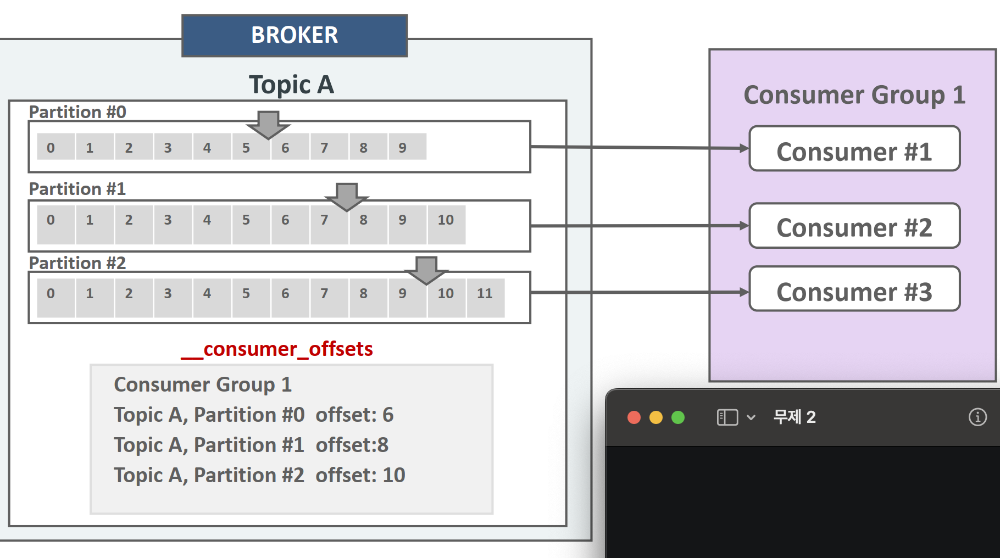

__consumer_offsets에는 Consumer Group이 특정 topic의 파티 션별로 읽기 commit한 offset 정보를 가짐. 

특정 파티션을 어느 consumer가 commit 했는지 정보를 가지지 않음

오프셋 특징

* 오프셋은 각 파티션(partition) 내에서 고유하며, 다른 파티션 간에는 중복될 수 있다.
* 읽은 후 커밋되지 않으면 오프셋은 증가하지 않음

### 중복 읽기상황

소비자가 메시지를 읽고 처리했지만, 해당 오프셋을 커밋하기 전에 장애가 발생하면 동일 메시지를 다시 읽게된다.

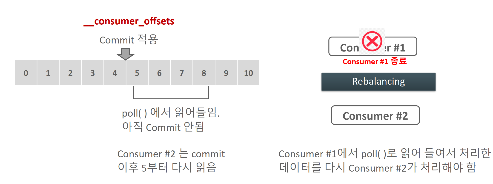

컨슈머 1이 5부터 8까지 4개의 메시지를 읽었는데, 아직 커밋을 못하고 무슨 문제가 생겨서 리밸런싱이 발생.

컨슈머 2는 커밋을 못했으므로 다시 5부터 읽게 되는 상황 

* 디비에는 커밋을 했는데 컨슈머에 커밋 하다가 장애가 발생한다면?

메시지에 포함된 고유 식별자(예: `messageId`, `eventId`)를 기반으로 처리 여부를 확인.

DB 테이블에 고유 키를 설정하거나, 처리 여부를 기록하는 테이블 사용 -> 트랜잭션 아웃박스 패턴 

```sql
메시지 처리 상태(예: 처리 완료 여부)를 별도의 테이블에 저장.
처리 완료 상태를 확인한 후 중복 실행 방지.

SELECT * FROM processed_messages WHERE message_id = '100';
```

또는

**Kafka의 트랜잭션 API 사용**:

- 카프카는 **트랜잭션 API**를 제공하여 DB 작업과 오프셋 커밋을 하나의 트랜잭션으로 묶을 수 있음.
- Kafka 트랜잭션 프로듀서를 사용해 원자적 처리가 가능.

```java
producer.initTransactions();

try {
    producer.beginTransaction();
    
    // 메시지 처리 후 DB에 저장
    saveToDatabase(record);

    // 메시지 오프셋 커밋
    producer.sendOffsetsToTransaction(offsets, consumerGroupId);
    
    producer.commitTransaction();
} catch (Exception e) {
    producer.abortTransaction(); // 트랜잭션 중단
}
```

#### 해결 방법:

- 멱등성 처리(idempotent processing)
  - 메시지 처리 로직을 설계할 때 동일 메시지가 여러 번 처리되더라도 결과가 같도록 구현.
- 커밋 후 처리(commit-after-processing)
  - 메시지를 완전히 처리한 후 오프셋을 커밋.
  - 단, 이 경우 메시지가 완전히 처리되기 전에 소비자가 장애를 일으키면 메시지가 누락될 수 있음.

### 읽기 누락 (loss)

컨슈머가 poll한 상태에서 바로 자동 커밋을 하고 메시지가 다 처리되기 전 장애가 터져 유실된 상황

#### 예시:

1. 소비자가 메시지 오프셋 `200`을 읽음.
2. 메시지를 처리 중에 자동 커밋이 실행되어 오프셋 `201`로 커밋됨.
3. 처리 도중 소비자가 장애 발생 → `200`번 메시지가 누락됨.

#### 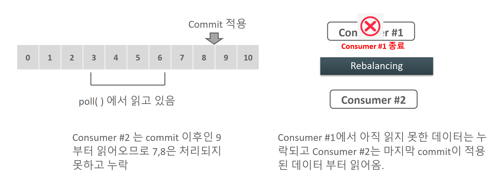

#### 해결 방법:

- 수동 커밋 : 메시지가 완전히 처리된 후 명시적으로 오프셋을 커밋.
- 재처리 가능한 설계 : 메시지가 누락되더라도 재처리할 수 있는 아키텍처 설계.


발생할 수 있는 다른 문제들

| **상황**           | **원인**                              | **해결책**                               |
| ------------------ | ------------------------------------- | ---------------------------------------- |
| 중복 읽기          | 오프셋 커밋 이전 장애, 수동 커밋 지연 | 멱등성 처리, 커밋 후 처리                |
| 읽기 누락          | 자동 커밋 시점 문제, 오프셋 재설정    | 수동 커밋, 재처리 가능한 설계            |
| 메시지 순서 불일치 | 파티션 간 병렬 처리, 리밸런싱         | 파티션 단위 처리, Kafka Streams 활용     |
| 리밸런싱 문제      | 소비자 그룹 변경                      | 세션/폴링 타임아웃 설정, 리밸런싱 최소화 |
| 장기 미처리 메시지 | 소비자 그룹 비활성화, 처리 속도 부족  | 모니터링, 소비자 그룹 확장               |
| 파티션 데이터 손실 | 브로커 장애, 복제 부족                | ISR 설정, 복제 인수 증가                 |

## Consumer Offset 적용 유형

* Auto offset: 사용자가 명시적으로 코드로 commi을 기술하지 않아도 Consumer가 자동으로 지정된 기간마다 commit을 수행

* Manual Offset: 사용자가 명시적으로 commit을 기술. Sync, Async 방식이 있음

### Consumer의 auto commit

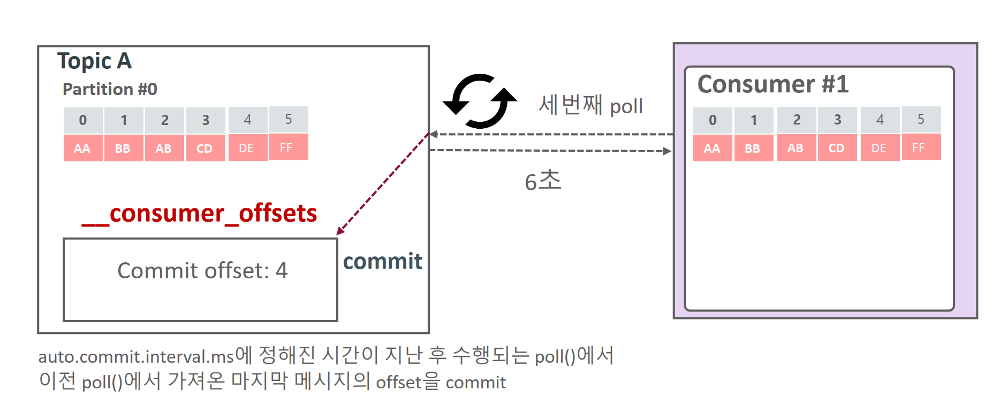

Consumer의 파라미터로 `auto.enable.commit=true` 인 경우 읽어온 메시지를 브로커에 바로 commit 적용하지 않고, `auto.commit.interval.ms`에 정해진 주기(기본 5초)마다 Consumer가 자동으로 Commit을 수행.

Consumer가 읽어온 메시지보다 브로커의 Commit이 오래 되었으므로 Consumer의 장애/재기동 및 Rebalancing 후 **브로커에서 이미 읽어온 메시지를 다시 읽어와서 중복 처리 될 수 있음.**

## 컨슈머의 Manual 동기/비동기 Commit

Consumer client는 일정 주기마다 자동으로 Commit하지 않고 API를 이용하여 동기 또는 비동기 Commit을 적용할 수 있음.

| **Sync(동기 방식)**                                          | **ASync(비동기 방식)**                                       |
| ------------------------------------------------------------ | ------------------------------------------------------------ |
| Consumer 객체의 `commitSync()` 메소드를 사용.                | Consumer 객체의 `commitAsync()` 메소드를 사용.               |
| 메시지 배치를 `poll()`을 통해 읽어오고 해당 메시지들의 마지막 offset을 브로커에 Commit 적용. | 메시지 배치를 `poll()`을 통해 읽어오고 해당 메시지들의 마지막 offset을 브로커에 Commit 요청만 하고, 성공 여부를 기다리지 않고 계속 메시지를 읽어옴. |
| 브로커에 Commit 적용이 성공적으로 될 때까지 블로킹 적용.     | 브로커에 Commit 적용이 실패해도 다시 Commit 시도 안 함.      |
| Commit 적용 완료 후에 다시 메시지를 읽어옴.                  | Consumer 장애 또는 Rebalance 시, 한 번 읽은 메시지를 중복해서 가져올 수 있음. |
| 브로커에 Commit 적용이 실패할 경우 다시 Commit 적용 요청.    | 동기 방식 대비 더 빠른 수행 시간.                            |
| 비동기 방식 대비 더 느린 수행 시간.                          |                                                              |

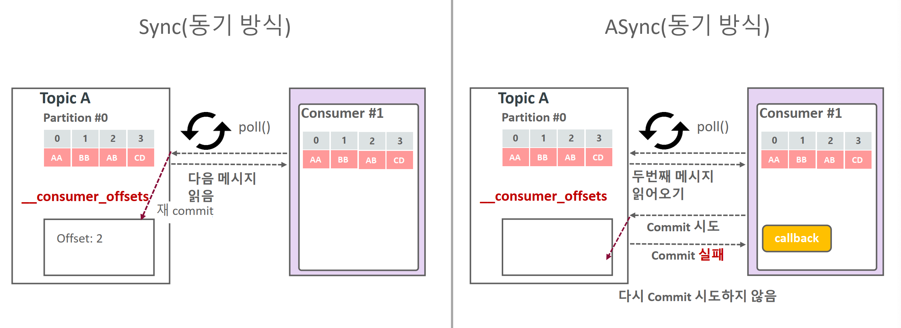

적용방법

- enable.auto.commit = falseE Consumer Property #X
- 동기 commit은 KafkaConsumer의 commitsync()메소드를 호출
- 비동기 commit은 KafkaConsumer의 commitAsync()메소드를 호출

## Consumer에서 특정 Topic의 특정 파티션만 할당하기

- Consumer에게 여러 개의 파티션이 있는 Topic에서 특정 파티션만 할당 가능. 배치 처리시 특정 key레벨의 파티션을 특정 Consumer에 할당하여 처리할 경우 적용
- KafaConsumer의 assign() 메소드에 TopicPartition 객체로 특정 파티션을 인자로 입력하여 할당

```java
TopicPartition topicPartition = new TopicPartition(topicName, 0);
kafkaConsumer.assign(Arrays.asList(topicPartition));
```

```java
String topicName = "pizza-topic";
Properties props = new Properties();
props.setProperty(ConsumerConfig.BOOTSTRAP_SERVERS_CONFIG, "127.0.0.1:9092");
props.setProperty(ConsumerConfig.KEY_DESERIALIZER_CLASS_CONFIG, StringDeserializer.class.getName());
props.setProperty(ConsumerConfig.VALUE_DESERIALIZER_CLASS_CONFIG, StringDeserializer.class.getName());

props.setProperty(ConsumerConfig.GROUP_ID_CONFIG, "group_pizza_assign_seek");
//props.setProperty(ConsumerConfig.AUTO_COMMIT_INTERVAL_MS_CONFIG, "6000");
props.setProperty(ConsumerConfig.ENABLE_AUTO_COMMIT_CONFIG, "false");

KafkaConsumer<String, String> kafkaConsumer = new KafkaConsumer<String, String>(props);

TopicPartition topicPartition = new TopicPartition(topicName, 0);

kafkaConsumer.assign(Arrays.asList(topicPartition));
```

