# 섹션10 멀티 노드 카프카 클러스터

- 분산 시스템으로서 카프카의 성능과 가용성을 함께 향상 시킬 수 있도록 구성
- 스케일 아웃 기반으로 노드 증설을 통해 카프카의 메시지 전송과 읽기 성능을 (거의) 선형적으로 증 가 시킬 수 있음
- 데이터 복제(Replication)을 통해 분산 시스템 기반에서 카프카의 최적 가용성을 보장

## 분산시스템 장단점

- 분산 시스템 도입을 위해서는 성능, 안정성, 가용성 측면에서 상세한 기능 검토가 요구
- 분산 시스템은 대량 데이터를 여러 노드간 분산 처리를 통해 빠르게 처리할 수 있는 큰 성능적 이점을 가지지만 **안정성과 가용성 측면**에서 상대적인 단점을 가짐

**단일 노드 구성(Scale Up)**

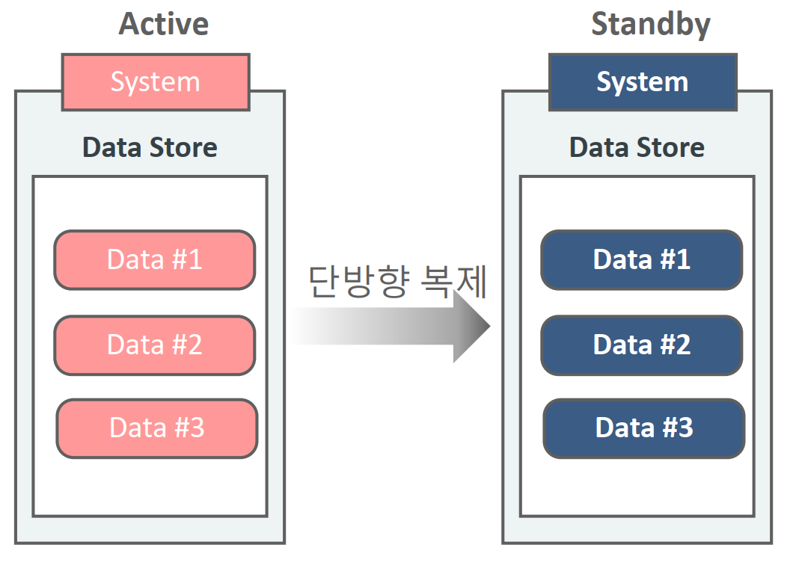

- H/W을 CPU Core, Memory 용량, 디스크 용량, 네트웍 Bandwidth를 Scale Up 방식으로 증설 하기에는 한계(비용, H/W 아키텍처)
- 단일 노드에 대해서만 가용성 구성을 강화 하면 되므로 매우 안정적인 시스템 구성이 가능
- 소프트웨어에서 다양한 성능향상 기법을 도입하기 매우 쉬움.

**다수의 노드로 분산 구성(스케일 아웃)**

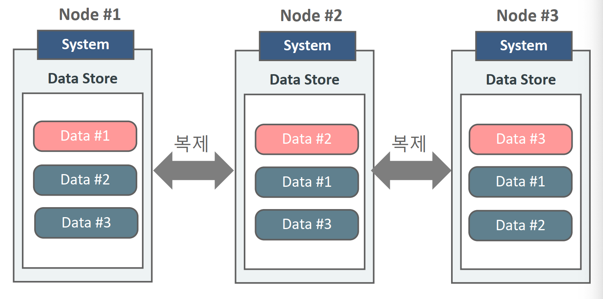

- 개별 H/W 노드를 Scale Out 방식으로 증 설하여 대용량 데이터 성능 처리를 선형 (?)적으로 향상
- 다수의 H/W가 1/N의 데이터를 처리하므 로 이중 한 개의 노드에서만 장애가 발생 해도 올바른 데이터 처리가 되지 않음.
- 다수의 H/W로 구성하였으므로 빈번한 장애 가능성, 관리의 부담
- 소프트웨어 자체에서 성능/가용성 처리제약

### 멀티 노드 카프카 클러스터

- 분산 시스템으로서 카프카의 성능과 가용성을 함께 향상 시킬 수 있도록 구성
- 스케일 아웃 기반으로 노드 증설을 통해 카프카의 메시지 전송과 읽기 성능을 (거의) 선형적으로 증가 시킬 수 있음
    - 파티션 증가. 
- 데이터 복제(Replication)을 통해 분산 시스템 기반에서 카프카의 최적 가용성을 보장

설치방법

* 3개의 브로커를 VM에 구성(다른시스템 )

* 개별 브로커들을 각각 서로 다른 serverproperties로 설정(server01.properties, server02.properties, server03.properties)

* 개별 브로커들이 서로 다른 logg.dirs를 가짐

* 개별 브로커들이 서로 다른 port 번호를 가짐(9092, 9093, 9094)

* serverproperties에 서로 다른 broker.id 설정

### 카프카 리플리케이션 

- 카프카는 개별 노드의 장애를 대비하여 높은 가용성을 제공.
- 카프카 가용성의 핵심은 리플리케이션(Replication, 파티션 복제)
- Replication은 토픽 생성 시 replication factor 설정값을 통해 구성
- Reflication factor가 3이면 원본 파티션과 복제 파티션을 포함하여 모두 3개의 파티션을 가짐을 의미
    - Replication factor의 개수는 브로커의 개수 보다 클 수 없음. (브로커당 1개)
    - Replication의 동작은 토픽내의 개별 파티션들을 대상으로 적용
        - 파티션이 3개면 이고 리플리케이션 팩터가 3이라면 3x3 파티션이 생김 
- Replication factor의 대상인 파티션들은 1개의 Leader와 N개의 Follower로 구성됨.
    - 모든 프로듀서와 컨슈머는 리더에서만 읽고 쓰기를 시행 
    - 리플리케이션도 리더에서 팔로워로만 이뤄짐
    - 리더 파티션의 브로커는 프로듀서 컨슈머의 읽기 쓰기 및 파티션 팔로워를 관리하는 브로커의 리플리케이션도 관리 

## 카프카 replication의 Leader와 Follower

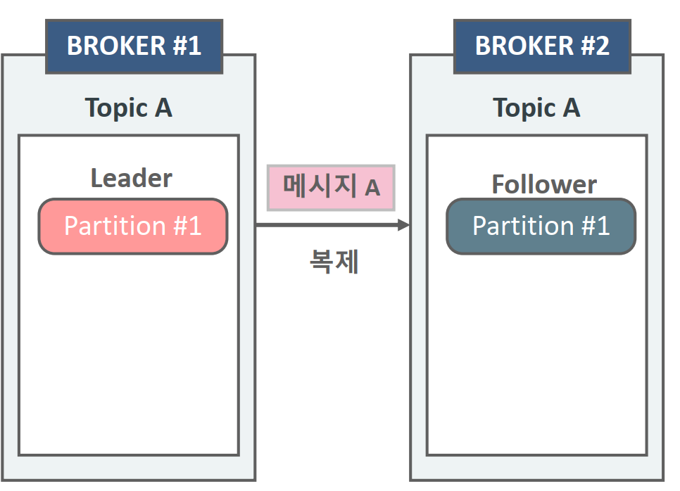

- Producer와 Consumer는 Leader 파티션를 통해서 쓰기와 읽기 수행
    - Kafka 2.4 부터 Consumer는 follower fetching도 가능
- 파티션의 Replication은 Leader 에서 Follower 으로만 이뤄짐
- 파티션 리더를 관리하는 브로커는 Producer/Consumer의 읽기/쓰기  를 관리함과 동시에 파티션 팔로우를 관리하는 브로커의 Replication 도 관리

### 단일 파티션의 복제

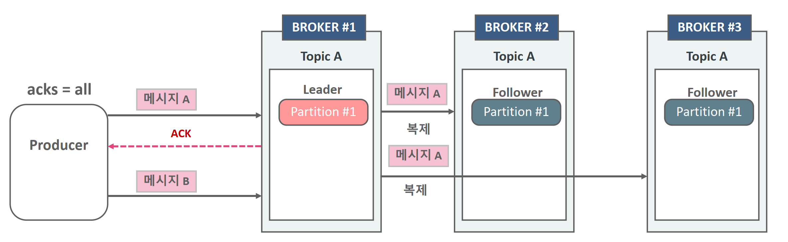

- 파티션의 Replication은 Leader 에서 Follower 으로만 이뤄짐
- 파티션 리더를 관리하는 브로커는 Producer/Consumer의 읽기/쓰기를 관리함과 동시에 파티션 팔로우를 관리하는 브로커 의 Replication도 관리
- akcs = all이면 복제하고있는 다른 브로커들이 모두 복제가 완료되기 전까지 기다린다. 

### 멀티 파티션의 복제

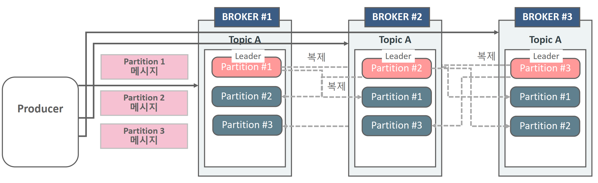

* 각 파티션의 리더 브로커에게 메시지가 전송되고 팔로워 브로커들이 메시지를 복제한다. 

* **리더 브로커가 메시지를 수신**

  - 리더 브로커는 프로듀서로부터 받은 메시지를 자신의 **로컬 로그**에 먼저 기록

  **팔로워 브로커로 복제**

  * 해당 파티션의 팔로워 브로커이 리더 브로커의 메시지를 풀링

  - 리플리케이션 팩터가 3이므로, 메시지는 동일한 파티션의 2개의 팔로워 브로커로 복제.
    - 예를 들어:
      - `partition 0`의 리더 브로커가 브로커 1이라면, 팔로워는 브로커 2와 브로커 3
      - 브로커 1이 브로커 2와 브로커 3으로 메시지를 복제

  **ISR(In-Sync Replicas) 관리**

  - ISR(동기화된 복제본) 목록에 포함된 브로커들이 복제 과정을 통해 메시지를 동기화
  - ISR은 리더 브로커가 확인 가능한 팔로워들의 목록으로, 각 팔로워는 리더의 로그를 지속적으로 따라가야 함.

  **복제 완료 확인**

  - 팔로워 브로커가 메시지를 자신의 로그에 기록하면, 리더 브로커에 ACK(확인 메시지)를 전송
  - 리더 브로커는 ISR의 모든 브로커로부터 ACK를 수신하면 메시지를 "커밋" 상태로 설정

### 멀티 노드(브로커)에서 멀티 파티션 및 다중 복제 토픽 생성

1. 3개의 파티션과 replication factor 3인 토픽 생성. 
   kafka-topics --bootstrap-server localhost:9092 --create --topic topic-p3r3 --partitions 3 --replication-factor 3

2. topic-p3r3 에 producer로 메시지 전송.  
   kafka-console-producer --bootstrap-server localhost:9092 --topic topic-p3r3

3. dump를 이용하여 Leader와 Follower 파티션에 전송된 메시지를 읽어보기 
   kafka-dump-log --deep-iteration --print-data-log --files ~/data/kafka-logs-0?/topic-p3r3-?/00000000000000000000.log

4. replication factor 4인 토픽 생성(에러 발생)
   kafka-topics --bootstrap-server localhost:9092 --create --topic topic-p3r4 --partitions 3 --replication-factor 4

5. 3개의 파티션과 replication factor 2인 토픽 생성.
   kafka-topics --bootstrap-server localhost:9092 --create --topic topic-p3r2 --partitions 3 --replication-factor 2

6. 2개의 파티션과 replication factor 3인 토픽 생성.
   kafka-topics --bootstrap-server localhost:9092 --create --topic topic-p2r3 --partitions 2 --replication-factor 3


## Java Producer Clients에서 Multi Borkers 접속

```java
package com.yscorp.producer;

import java.util.Properties;

import org.apache.kafka.clients.producer.KafkaProducer;
import org.apache.kafka.clients.producer.ProducerConfig;
import org.apache.kafka.clients.producer.ProducerRecord;
import org.apache.kafka.common.serialization.StringSerializer;
import org.slf4j.Logger;
import org.slf4j.LoggerFactory;

public class MultiBrokerProducer {
	public static final Logger logger = LoggerFactory.getLogger(MultiBrokerProducer.class.getName());

	public static void main(String[] args) throws InterruptedException {
		Properties props = new Properties();
		props.setProperty(ProducerConfig.BOOTSTRAP_SERVERS_CONFIG, "127.0.0.1:9092, 127.0.0.1:9094, 127.0.0.1:9096");
		props.setProperty(ProducerConfig.KEY_SERIALIZER_CLASS_CONFIG, StringSerializer.class.getName());
		props.setProperty(ProducerConfig.VALUE_SERIALIZER_CLASS_CONFIG, StringSerializer.class.getName());

		String topicName = "topic-p2r3";
		KafkaProducer<String, String> kafkaProducer = new KafkaProducer<>(props);

		final ProducerRecord<String, String> test1 = new ProducerRecord<>(topicName, "test1");

		kafkaProducer.send(test1, (recordMetadata, e) -> {
			if (e != null) {
				logger.info("Exception occurred: {}", e.getMessage(), e);
			} else {
				logger.info("RecordMetadata: partition={}, offset={}, timestamp={}",
						recordMetadata.partition(), recordMetadata.offset(), recordMetadata.timestamp());
			}
		});

		Thread.sleep(3000);
		kafkaProducer.close();
	}
}
```

* Producers는 bootstrap.servers에 기술되어 있는 브로커들의 List를 기반으로 접속
  *  boostrap.servers는 브로커 Listener들의 List 임

* 개별 Broker들은 토픽 파티션의 Leader와 Follower들의 메타 정보를 서로 공유하고, Producer는 초기 접속 시 이 메타 정보를 가져와서 접속하려는 토픽의 파티션이 있는 브로커로 다시 접속

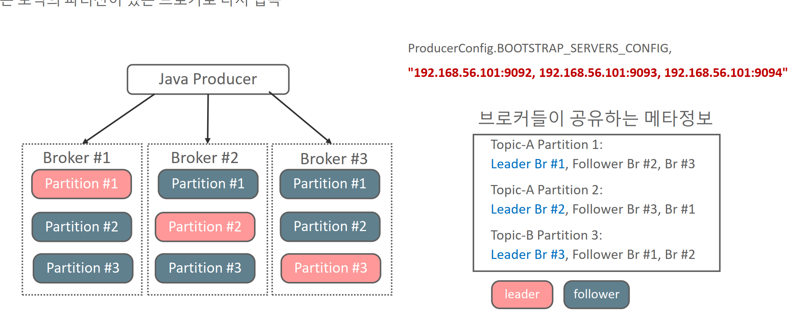

* 기술한 모든 브로커에 접속하는것이 아님.
* 프로듀서는 어떤 토픽이 파티션이 어떻게 구성되어있고 개별 파티션이 리더가 뭔지 필요하다. 즉 메타정보가 필요한것 
  * 부트스트랩 서버(bootstrap server)**를 기술하는 이유는 **카프카 클러스터에 연결하고 메타데이터를 가져오기 위해서임.
  * 부트스트랩 서버는 **클러스터 내 일부 브로커**만 명시하면 된다. 이유는:
    - 카프카 클러스터는 브로커들 간에 메타데이터를 공유하고 동기화
    - 프로듀서가 부트스트랩 서버로 명시된 브로커 하나에만 연결해도, 해당 브로커는 클러스터 전체의 메타데이터를 반환할 수 있다.
    - 따라서 모든 브로커를 명시하지 않아도 클러스터 전체에 연결할 수 있다.
  * 부트스트랩 서버가 장애를 일으켜도, 이미 얻은 메타데이터를 통해 정상 동작 중인 브로커와 계속 연결할 수 있다. 
  * 그래도 초기 연결시에도 장애가 있을 수 있으므로 복수개를 구성하는것이 좋다. 


## 주키퍼와 컨트롤러 브로커의 이해

주키퍼 : 분산시스템간의 정보를 신속하게 공유하기 위한 코디네이션 시스템 

* 주키퍼는 동물원 관리자 라는 뜻임 

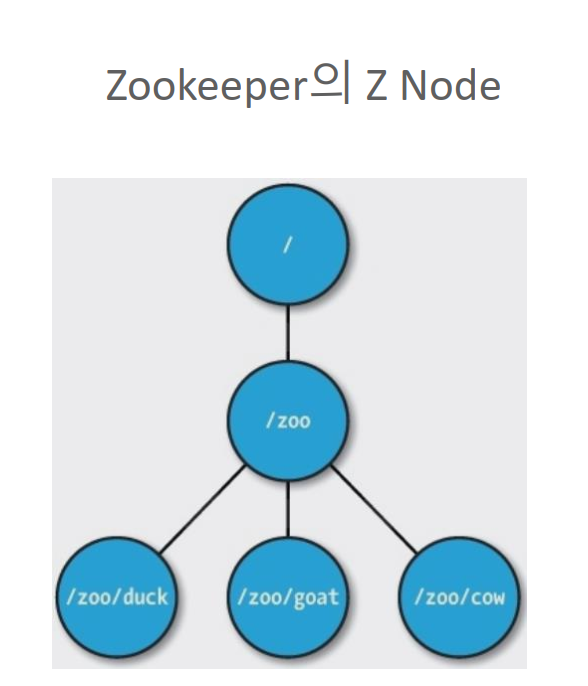

- 클러스터내 개별 노드의 중요한 상태 정보를 관리하며 분산 시스템에서 리더 노드를 선출하는 역할등을 수행
    - 주키퍼는 Kafka 클러스터에서 하나의 **컨트롤러 브로커**를 선출. 컨트롤러 브로커는 클러스터 관리를 담당
    - 토픽, 파티션, 리플리케이션 정보 저장.
    - 브로커와 리더 파티션의 상태를 관리.
- 개별 노드간 상태 정보의 동기화를 위한 복잡한 Lock 관리 기능 제공
- 간편한 디렉토리 구조 기반의 Z Node를 활용
- ZNode는 개별 노드의 중요 정보를 담고 있음
- 개별 노드들은 Zookeeper의 Z Node를 계속 모니터링하며 Z Node에 변경 발
    생 시 Watch Event가 트리거 되어 변경 정보가 개별 노드들에 통보
- Zookeeper 자체의 클러스터링 기능 제공

카프카 정보 관리

- 모든 카프카 브로커는 주기적으로 Zookeeper에 접속하면서 Session Heartbeat을 전송하여 자신의 상태를 보고함
- Zookeeeper는 **zookeeper.session.timeout.ms** 이내에 HeartBeat을 받지 못하면 해당 브로커의 노드 정보를 삭제하고 Controller 노드에게 변경 사실을 통보
- Controller노드는 다운된 브로커가 관리하는 파티션 들에 대해서 새로운 파티션 Leader Election을 수행
- 만일 다운된 브로커가 Controller이면 모든 노드에게 해당 사실을 통보하고 가장 먼저 접속한 다른 브로커가 Controller가 됨.

### 컨트롤러 브로커

*  Zookeeper에 가장 처음 접속을 요청한 Broker가 Controller가 됨

- Controller는 파티션에 대한 Leader Election을 수행
- Controller는 Zookeeper로 부터 broker 추가/Down등의 정보를 받으면 해당 broker로 인해 영향을 받는 파티션들에 대해서 새로운 Leader Election을 수행.

컨트롤러 리더 선출 (leader election) 수행 프로세스

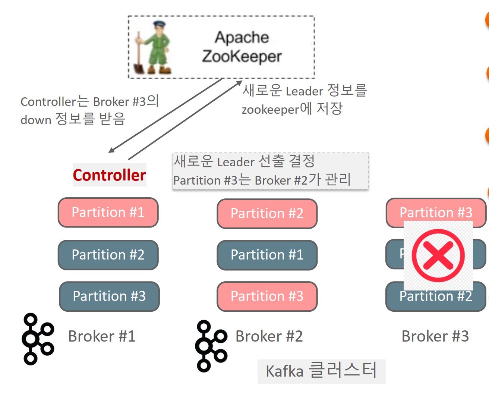

1. Broker #3이 Shutdown 되고 Zookeeper는 session 기간동안 Heartbeat이 오지 않으므로 해당 브로커 노드 정보 갱신

2. Controller는 Zookeeper를 모니터링 하던 중 Watch Event로 Broker#3에 대한 Down 정보를 받음.

3. Controller는 다운된 브로커가 관리하던 파티션들에 대해 새로 운 Leader/Follower 결정
4. 결정된 새로운 Leader/Follower 정보를 Zookeeper에 저장하고 해 당 파티션을 복제하는 모든 브로커들에게 새로운 Leader/Follower 정보를 전달하고 새로운 Leader로 부터 복제 수 행할 것을 요청

5. Controller는 모든 브로커가 가지는 Metadatacache를 새로운 Leader/Follower 정보로 갱신할 것을 요청


Kafka는 원래 **주키퍼**를 사용하여 클러스터의 메타데이터와 상태를 관리했다.

그러나 kraft 가 나오고 난 이후 자체적으로 관리하도록 됐다.

## **KRaft (Kafka Raft)**

### 역할

KRaft는 Kafka에서 주키퍼를 제거하고 자체적으로 클러스터 메타데이터를 관리하도록 설계된 새로운 아키텍처 Kafka 2.8.0에서 소개되었고, Kafka 3.x부터는 기본 옵션으로 주키퍼를 대체하고 있다.

KRaft는 **Raft Consensus Algorithm**을 기반으로 하여 다음과 같은 역할을 한다:

1. **주키퍼 제거**:
   - 주키퍼 없이 Kafka 자체에서 메타데이터 관리.
   - 모든 Kafka 브로커가 메타데이터를 공유하며, 리더를 선출하고 상태를 동기화.
2. **컨트롤러 브로커 통합**:
   - KRaft에서는 **컨트롤러 브로커**가 메타데이터를 관리하며, 이 역할이 분산 Raft 그룹에서 관리.
   - Raft 그룹에서 리더를 선출하며, 리더가 컨트롤러 역할을 수행.
3. **더 나은 성능**:
   - Kafka의 내부 메타데이터 관리가 간소화되고, 더 빠르고 안정적인 장애 복구 가능.
4. **단일 프로세스 클러스터**:
   - 주키퍼를 별도로 설치하고 관리할 필요가 없어 운영 복잡성이 감소.

## ISR (In-SyncReplicas)의 이해

SR은 특정 파티션의 **리더(replica)**와 데이터를 **동기화**하고 있는 팔로워(replica)들의 집합이다.
즉, **리더와 동일한 데이터를 유지하고 있는 복제본들(replica)의 목록**

* ISR에는 항상 **리더**가 포함
* 팔로워가 리더의 데이터를 일정 지연 시간 내에 따라잡으면 ISR에 남아 있게 되고, 그렇지 않으면 ISR에서 제거
* Follower들은 누구라도 Leader 가 될 수 있지만, 단, ISR 내에 있는 Follower들만 가능.
* 파티션의 Leader 브로커는 Follower 파티션의 브로커들이 Leader가 될 수 있는지 지속적으로 모니터링 수행하 여 ISR을 관리
* Leader 파티션의 메시지를 Follower가 빠르게 복제하지 못하고 뒤쳐질 경우 ISR에서 해당 Follower는 제거되며 Leader가 문제가 생길 때 차기 Leader가 될 수 없음.

**isr의 특징** 

1. **복제 데이터의 신뢰성 보장**
   ISR은 리더와 동기화된 상태를 유지하므로, ISR에 포함된 복제본은 항상 최신 데이터를 가지고 있다고 간주
2. **리더 장애 시 새로운 리더 선출**
   리더가 장애가 발생하면 ISR에 있는 팔로워 중 하나가 새로운 리더로 선택됩니다. 이를 통해 데이터 손실을 최소화할 수 있다.
3. **replica.lag.time.max.ms**
   - 팔로워가 리더의 데이터를 따라잡지 못하고 지정된 시간(`replica.lag.time.max.ms`) 이상 지연되면 ISR에서 제외
   - 이는 데이터 동기화가 느린 복제본을 배제하여 클러스터의 안정성을 유지하려는 목적

**ISR과 데이터의 내구성**

ISR은 데이터의 내구성과 관련이 깊다.
프로듀서가 메시지를 전송할 때 **`acks` 설정**에 따라 ISR이 영향을 미친다.

1. **`acks=1`**
   - 리더가 메시지를 수신하면 즉시 프로듀서에게 응답
   - ISR과의 동기화는 보장되지 않으므로 데이터 손실 위험이 있다.
2. **`acks=all` (또는 `-1`)**
   - ISR의 모든 복제본이 데이터를 저장한 후에만 프로듀서에게 응답
   - 가장 높은 내구성을 보장 그러나 속도가 느림. 

### ISR 조건

* 브로커가 Zookeeper에 연결되어 있어야함. 2ookeeper session.timeout.ms 로 지정된 기간(기본 6초, 최대 18초)내에 Heartbeat 을 지속적으로 Zookeeper로 보냄

* replica.lag.time.max ms로 지정된 기간(기본 10초, 최대 30초)내에 Leader의 메시지를 지속적으로 가져 가야함

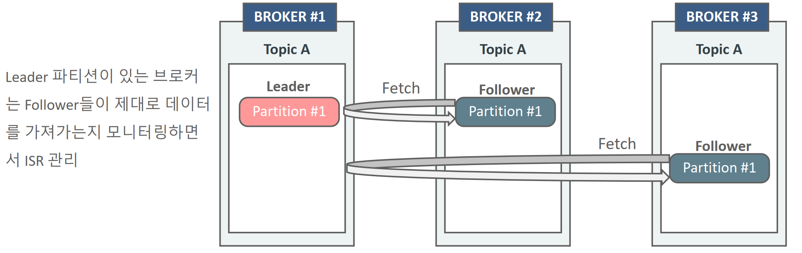

- Follower는 Leader에게 Fetch 요청을 수행. Fetch 요청에는 Follower가 다음에 읽을 메시지의 offset 번호를 포함
- Leader는 Follower가 요청한 Offset 번호와 현재 Leader partition의 가장 최신 offset 번호를 비교하여 Follower가 얼마나 Leader 데이터 복제를 잘 수행하고 있는지 판단

## min.insync.replicas 의 이해

min.insync.replicas 파라미터는 브로커의 설정값으로 Producer가 acks=all 로 성공적으 로 메시지를 보낼 수 있는 최소한의 ISR 브로커 개수를 의미

프로듀서가 메시지를 성공적으로 기록하기 위해 필요한 **최소 동기화 복제본(ISR)의 개수**를 지정하는것이다.

* 이 설정은 **`acks=all`**(또는 `acks=-1`)로 메시지를 전송할 때만 적용
* ISR의 복제본 수가 `min.insync.replicas`에 미치지 못하면 프로듀서의 메시지 전송이 실패
* 즉, **클러스터의 데이터 내구성 보장 수준을 강화**하는 역할

`min.insync.replicas`는 **토픽 단위** 또는 **브로커 단위**로 설정할 수 있다. 

* 브로커 단위 : server.properties 파일에 min.oinsync.replicas=2
* 토픽 단위 : kafka-topics --alter topic 토픽명 --config min.insync.replicas=2


### min.insync.replicas 설정에 따른 Producer 전송

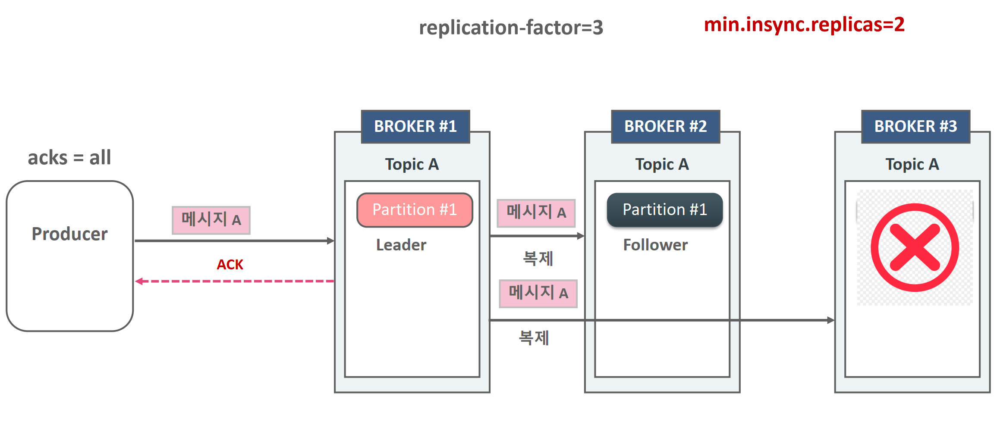

* 토픽의 리플리케이션 팩터는 3이고 min.insync.repliacas=2, 브로커 1대가 죽어도 ISR이 2면 메시지 전송에 성공한다. 

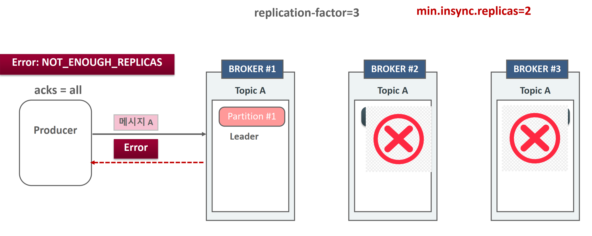

* 토픽의 리플리케이션 팩터는 3이고 min.insync.replicas=2인데 브로커 2개가 죽으면 isr은 1개만된다, 이때는 메시지를 전송할 수 없다. 

## Preferred Leader Election

Apache Kafka에서 특정 파티션의 **리더(replica)**를 클러스터 내의 "선호 리더(preferred leader)"로 재설정하는 과정을 의미.

* 파티션 별로 최초 할당된 Leader/Follower Broker설정을 Preferred Broker로 그대로 유지

* Broker가 shutdown후 재 기동될 때 Preferred Leader Broker를 일정 시간 이후에 재 선출

* auto.leaderrebalance.enable=true로 설정하고 leader.imbalance.check.interval.seconds를 일정시간으로 설정(기본 300초)
* **Preferred Leader Election**은 선호 리더를 다시 리더로 설정하여 데이터 균형과 클러스터 안정성을 회복한다. 

## Preferred Leader Election 와 Unclean Leader Election

**Preferred Leader Election**와 **Unclean Leader Election**은 Kafka의 파티션 리더 선출 과정에서 발생할 수 있는 두 가지 서로 다른 메커니즘.

* Preferred Leader Election은 Kafka의 정상적인 운영 중 또는 장애 복구 후에 **선호 리더(preferred leader)**를 리더로 복원하는 과정
* Unclean Leader Election은 **ISR(In-Sync Replicas)**에 없는 복제본을 리더로 선출하는 비정상적인 상황

예시

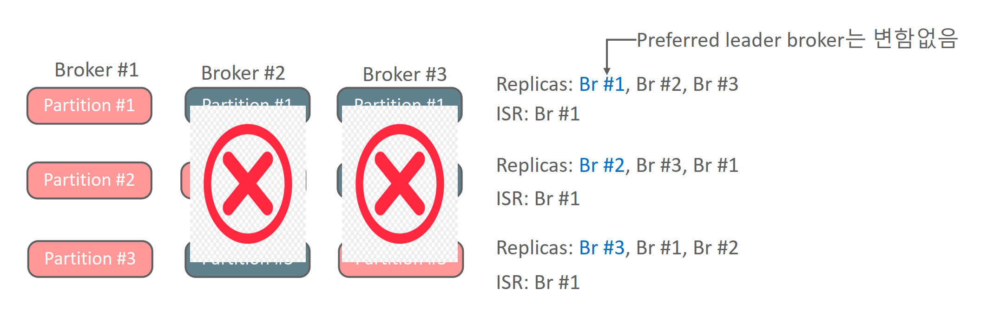

Broker #2,#3가 모두 shutdown되면 Partition #1, #2, #3의 Leader Broker는 Broker #1 이 됨.

Broker #1에 메시지가 추가로 계속 유입된 후 Broker #1 까지 shutdown 될 경우 이후 Broker #2,#3이 재 기동 되어도 Partition #1, #2, #3의 Leader Broker가 될 수 없음.

그러나 어떤 특별한 장애로, 

기존의 Leader 브로커가 오랜 기간 살아나지 않을 경우 복제가 완료되지 않은(out of sync) Follower Broker가 Leader가 될지 결정해야 함

이때 기존의 Leader 브로커가 가진 메시지 손실 여부를 감수하고 복제가 완료되지 않은 Follower Broker가 Leader가 되려면 unclean.leaderelection.enable=true로 설정하고 Unclean leader election 수행.

* 발생 조건
  * 클러스터 내 ISR 복제본이 모두 실패하여 ISR에 포함되지 않은 복제본만 남았을 때 발생한다.
  * 이러한 복제본은 리더 역할을 맡게 되더라도 최신 데이터를 가지고 있지 않을 가능성이 있다. 그로 인해, 최신 데이터를 잃어 버리고 데이터 손실 위험이 존재한다. 
* 설정방법
  * Kafka에서 Unclean Leader Election을 활성화할지 여부는 `unclean.leader.election.enable` 설정으로 관리.
    - 기본값: **`true`**
    - **`true`**: ISR이 없는 경우에도 리더를 선출하여 클러스터 가용성을 유지
    - **`false`**: ISR이 없는 경우 리더를 선출하지 않으며, 쓰기 작업이 중단

### **Preferred Leader Election vs. Unclean Leader Election**

| 특징                  | Preferred Leader Election             | Unclean Leader Election                    |
| --------------------- | ------------------------------------- | ------------------------------------------ |
| **발생 조건**         | 선호 리더가 ISR에 포함될 때 리더 복원 | 모든 ISR 복제본이 실패했을 때              |
| **리더 선택 대상**    | 선호 리더 (ISR 내 복제본 중 하나)     | ISR 외 복제본                              |
| **데이터 손실 위험**  | 없음                                  | 있음                                       |
| **주요 목적**         | 데이터 안정성 및 균형 유지            | 클러스터 가용성 유지                       |
| **Kafka 설정 의존성** | 기본적으로 활성화된 메커니즘          | `unclean.leader.election.enable` 설정 필요 |

