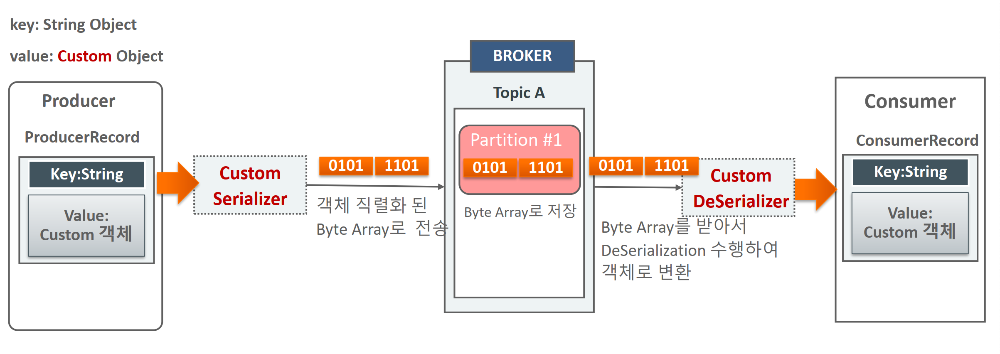

# 섹션 12 Producer와  Consumer의 Custom 객체 직렬화/역직렬화

- 업무적으로 다양한 유형의 클래스를 데이터 인터페이스로 설정하 고 해당 객체를 전송/읽기 필요
- Kafka는 Serializer/Deserializer는 string, Integer, Long등의 Primitive 기 반의 0bject들에 대해서만 기본 제공
- 업무적으로 사용되는 Customer, Order등의 데이터를 객체 형태로 전달하기 위해서는 **직접 Custom 객체의 Serializer/Deserializer를 구현해야 함**



카프카에서 제공하는 디폴트

- StringSerializer
- ShortSerializer
- IntegerSerializer
- LongSerializer
- DoubleSerializer
- BytesSerializer


JSON 예시

```java
public class JsonProducer {
	public static void main(String[] args) {
		// Kafka 프로듀서 설정
		Properties props = new Properties();
		props.put("bootstrap.servers", "localhost:9092");
		props.put("key.serializer", StringSerializer.class.getName());
		props.put("value.serializer", JsonSerializer.class.getName()); // JSON Serializer

		KafkaProducer<String, JsonObject> producer = new KafkaProducer<>(props);

		// 전송할 JSON 객체
		var obj = new JsonObject("key", new Random().nextInt(10000), "value");

		// Kafka 토픽으로 메시지 전송
		producer.send(new ProducerRecord<>("my-topic", obj));
		producer.close();
	}

}

public class JsonSerializer<T> implements Serializer<T> {
	private final ObjectMapper objectMapper = new ObjectMapper();

	@Override
	public void configure(Map<String, ?> configs, boolean isKey) {}

	@Override
	public byte[] serialize(String topic, T data) {
		try {
			return objectMapper.writeValueAsBytes(data);
		} catch (Exception e) {
			throw new RuntimeException("Error serializing JSON object", e);
		}
	}

	@Override
	public void close() {}
}

// consumer
public class JsonConsumer {
	public static void main(String[] args) {
		// Kafka 컨슈머 설정
		Properties props = new Properties();
		props.put("bootstrap.servers", "localhost:9092");
		props.put("group.id", "my-group");
		props.put("key.deserializer", StringDeserializer.class.getName());
		props.put("value.deserializer", JsonDeserializer.class.getName()); // JSON Deserializer
		props.put("value.deserializer.targetClass", JsonObject.class.getName());
		KafkaConsumer<String, JsonObject> consumer = new KafkaConsumer<>(props);
		consumer.subscribe(Collections.singletonList("my-topic"));

		//main thread
		Thread mainThread = Thread.currentThread();

		Runtime.getRuntime()
			.addShutdownHook(new Thread() {
				public void run() {
					System.out.println(" main program starts to exit by calling wakeup");
					consumer.wakeup();

					try {
						mainThread.join();
					} catch (InterruptedException e) {
						e.printStackTrace();
					}

				}
			});

		try {
			// 메시지 수신
			while (true) {
				ConsumerRecords<String, JsonObject> records = consumer.poll(Duration.ofMillis(1000));
				records.forEach(record -> {
					System.out.printf("offset = %d, key = %s, value = %s%n", record.offset(), record.key(),
						record.value());

				});
			}

		} catch (WakeupException e) {
			System.out.println("WakeupException occurred" + e.getMessage());
		} finally {
			consumer.close();
		}

	}
}


public class JsonDeserializer<T> implements Deserializer<T> {
	private final ObjectMapper objectMapper = new ObjectMapper();
	private Class<T> tClass;

	public JsonDeserializer() {
	}

	public JsonDeserializer(Class<T> tClass) {
		this.tClass = tClass;
	}

	@Override
	public void configure(Map<String, ?> configs, boolean isKey) {
		String targetClassName = (String) configs.get("value.deserializer.targetClass");
		try {
			System.out.println("targetClassName: " + targetClassName);
			tClass = (Class<T>) Class.forName(targetClassName);
		} catch (ClassNotFoundException e) {
			throw new RuntimeException("Target class not found: " + targetClassName, e);
		}
	}

	@Override
	public T deserialize(String topic, byte[] data) {
		try {
			return objectMapper.readValue(data, tClass);
		} catch (Exception e) {
			System.err.println("Failed to deserialize data: " + new String(data));
			throw new RuntimeException("Error deserializing JSON object", e);
		}
	}

	@Override
	public void close() {}
}
```

> spring boot에서는 다음과 같은 시리얼라이저와 디시리얼라이저가 있다.
>
> - org.springframework.kafka.support.serializer.JsonDeserializer
> - org.springframework.kafka.support.serializer.JsonSerializer

그러나 producer와 consumer의 클래스 위치가 다른 경우  Consumer에 도달하게 되면 Class Not Found 예외가 발생하게 된다.

그 이유는 Producer에서 메시지를 전송할 때 패키지 위치까지 모두 전송하므로 서로 간의 Mapping에 실패하게 된다. 위치 정보는 Header에 포함되어 있다.

해당 이슈를 해결하기 위해서는

1. StringDeserializer를 사용해 직렬화 된 String Json을 ObjectMapper로 역 직렬화한다.
2. Kafka 옵션 중 헤더 정보를 빼고 보낸다.
3. Kafka에서 지원하는 Type Mapping을 사용한다.

3번 방법  공식문서 🔗 https://docs.spring.io/spring-kafka/reference/kafka/serdes.html#serdes-mapping-types