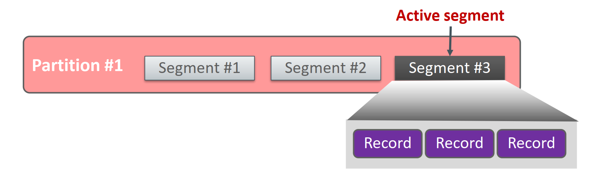
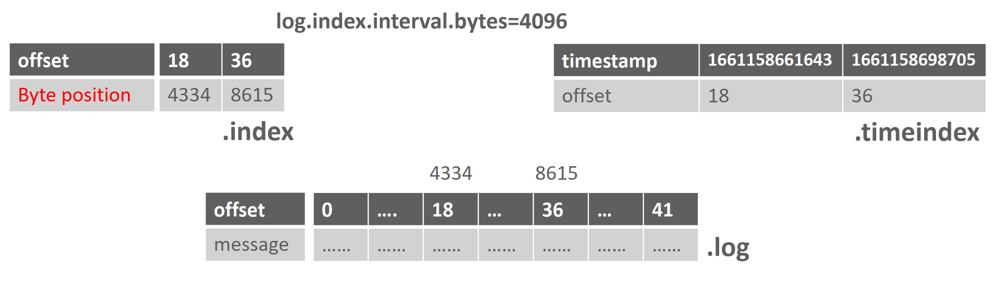
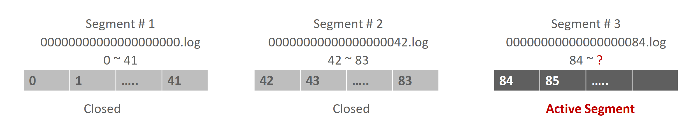
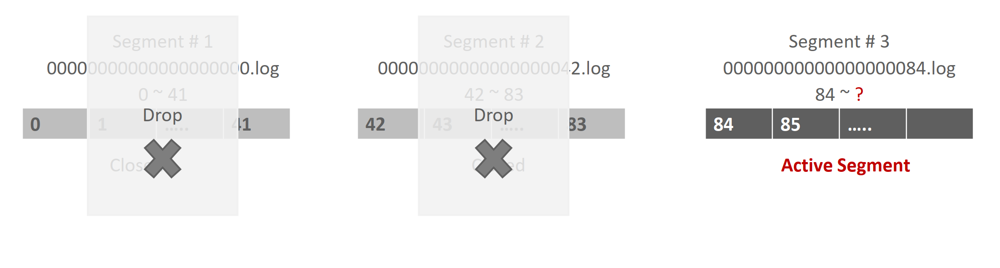
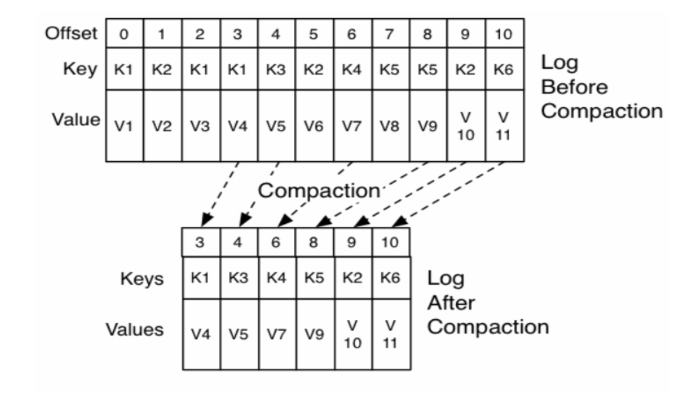
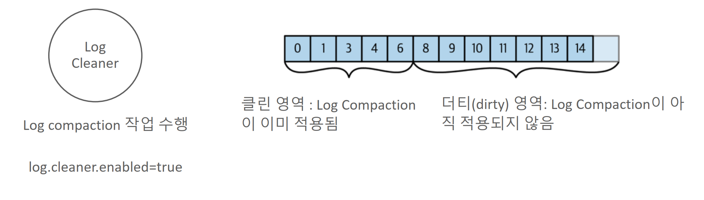
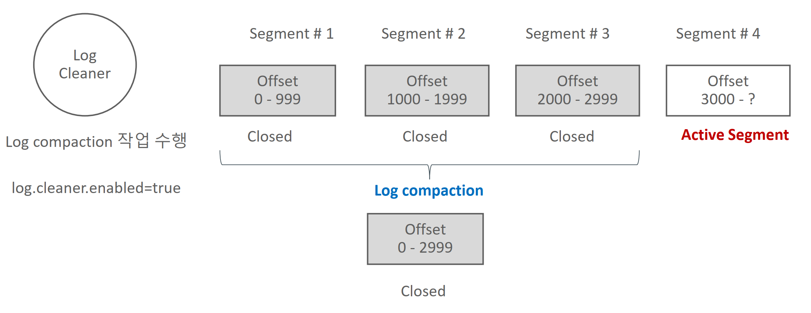
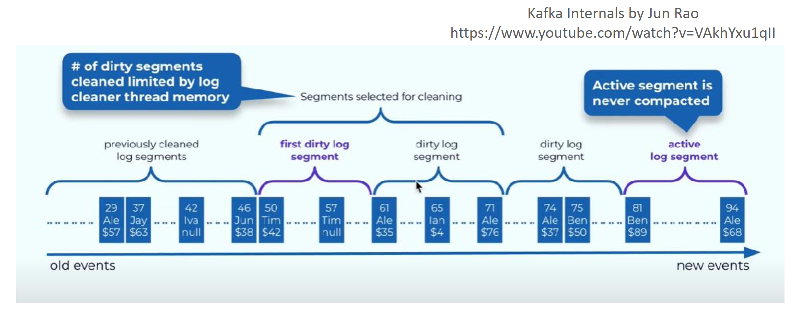
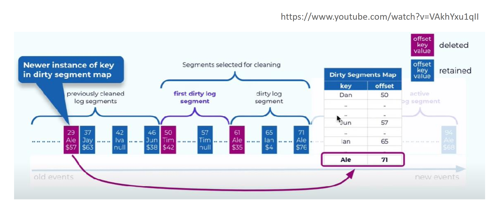
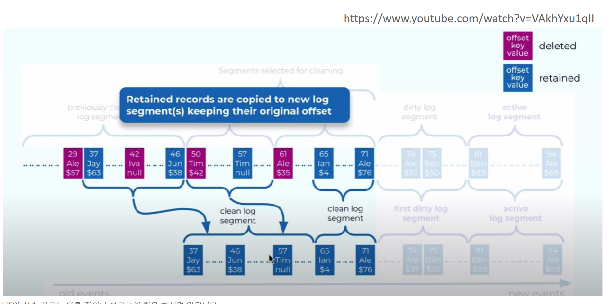

# 섹션 13 토픽과 세그먼트 관리



- 카프카의 로그 메시지는 실제로는 segment로 저장이 됨
- 파티션은 단순히 파일 디렉토리로만 되어 있고, 해당 파티션 디렉토리에 메시지 저장 segment를 file로 가지고 있음
- 파티션은 여러 개의 segmen로 구성되며 개별 segment는 데이터 용량이 차거나 일정 시간이 경과하면 cose 되고 새로운
    segment를 생성하여 데이터를 연속적으로 저장.
- Segment는 cose되면 더 이상 브로커가 write하지 않으며 read-only가 됨. 브로커는 여러 개의 segmen중에 단 하나의 active segment에만 write와 read를 수행. 하나의 파티션은 단 하나의 active segment를 가짐.

| **Config**              | **설명**                                                     |
| ----------------------- | ------------------------------------------------------------ |
| **log.segment.bytes**   | - 개별 segment의 최대 크기이며 기본값은 **1GB**.  <br />- 지정된 크기를 넘기면 해당 segment는 더 이상 **active segment**가 아니며 **close**됨 (쓰기 불가, 읽기만 가능).  <br />- Topic 수준의 설정은 `segment.bytes`로 지정되며, 기본값은 **10GB**. |
| **log.roll.hours (ms)** | - 개별 segment가 유지되는(roll 수행되기 전) 최대 시간이며 기본값은 **7일**.  <br />- 지정된 시간을 넘기면 해당 segment는 더 이상 **active segment**가 아니며 **close**됨 (쓰기 불가, 읽기만 가능). <br /> - `log.segment.bytes` 조건을 충족하지 않아도 `log.roll.ms`에 지정된 시간이 지나면 해당 segment를 **close**.  <br />- Topic 수준의 설정은 `segment.ms`로 지정되며, 기본값은 **log.roll.hours**를 따름. |

### 파티션 디렉토리내의 Segment와 Index 파일 구성

Topic을 생성하면 파티션 디렉토리내에 

* 메시지 내용을 가지는 segment와 
* offset의 위치 byte 정보를 가 지는 Index 파일,
* record 생성 시간에 따른 위치 byte 정보를 가지는 timeindex 파일로 구성됨.

### 메시지 로그 Segnement와 index, TimeIndex

* Index 파일은 offset 별로 byte position 정보를 가지고 있음. 메시지 Segment는 File기반이므로 특정 offset의 데이터를 파일에서 읽기 위해서는 시작 File Pointer에서 얼마만큼의 byte에 위치해 있는지 알아야함.

* Index 파일은 모든 offset에 대한 byte position 정보를 가지고 있지 않으며 log.index.interval.bytes에 설정된 값만큼의 segment bytes가 만들어질 때마다 해당 offset에 대한 byte position 정보를 기록함.

* Timeindex 파일은 메시지의 생성 Unix 시간을 밀리 세컨드 단위로 가지고 있고 해당 생성 시간에 해당하는 offset 정보를 가짐



### Segment 관련 명령어

```
1. pizza-topic-stest 토픽 생성 설정 확인.  
   kafka-topics --bootstrap-server localhost:9092 --create --topic pizza-topic-stest --partitions 3 

2. topic의 segment.bytes 설정을 10k bytes로 변경. 
   kafka-configs --bootstrap-server localhost:9092 --entity-type topics --entity-name pizza-topic-stest --alter --add-config segment.bytes=10240

3. 변경한 topic의 config를 다시 Default값으로 원복
   kafka-configs --bootstrap-server localhost:9092 --entity-type topics --entity-name pizza-topic-stest --alter --delete-config segment.bytes

4. topic의 segment.ms 설정을 60초로 변경. 
   kafka-configs --bootstrap-server localhost:9092 --entity-type topics --entity-name pizza-topic-stest --alter --add-config segment.ms=60000

5. 변경한 topic의 config를 다시 Default값으로 원복
   kafka-configs --bootstrap-server loca로host:9092 --entity-type topics --entity-name pizza-topic-stest --alter --delete-config segment.ms
   
설정 확인 명령어

docker exec -it kafka1 kafka-configs --bootstrap-server localhost:9092 --entity-type topics --entity-name pizza-topic-stest -all --describe | grep segment

  file.delete.delay.ms=60000 sensitive=false synonyms={DEFAULT_CONFIG:log.segment.delete.delay.ms=60000}
  segment.bytes=10240 sensitive=false synonyms={DYNAMIC_TOPIC_CONFIG:segment.bytes=10240, DEFAULT_CONFIG:log.segment.bytes=1073741824}
  segment.index.bytes=10485760 sensitive=false synonyms={DEFAULT_CONFIG:log.index.size.max.bytes=10485760}
  segment.jitter.ms=0 sensitive=false synonyms={}
  segment.ms=604800000 sensitive=false synonyms={}
```


### Segment 파일의 롤링

- Segment 파일은 rolling되어서 Active => Closed 단계로 상태 변경
- Segment 파일명은 해당 segmen 별로 시작 offset을 기반으로 작성됨
- 하나의 파티션에는 단 하나의 Active Segment만 존재



## Segment 파일의 생명 주기

-   Segment 파일은 Active => Closed => Deleted 또는 Compacted 단계로 관리

-   Segment 파일은 Log Cleanup 정책에 따라 지정된 특정 시간이나 파일 크기에 따라 삭제 되거나 Compact 형태로 저장됨

    - **로그 세분화**: 카프카의 각 파티션은 세그먼트 파일들로 나뉜다. 세그먼트는 동일한 크기 또는 시간 기준에 따라 생성

      - 디폴트 세그먼트 크기(`log.segment.bytes`)나 최대 시간(`log.roll.ms`)이 기준이 된다.

      **파일 구성**: 각 세그먼트는 두 가지 주요 파일로 구성된다.

      - `.log` 파일: 실제 메시지 데이터가 저장.
      - `.index` 파일: 오프셋 인덱스와 메시지 위치 매핑 정보가 저장

    - 데이터 쓰기

      - **순차 쓰기**: 데이터는 활성 세그먼트(active segment)에 순차적으로 기록

        **새 세그먼트 생성**: 활성 세그먼트가 설정된 크기나 시간이 초과하면, 새로운 세그먼트가 생성되고 활성화

        **인덱스 업데이트**: 데이터가 쓰여질 때마다 해당 메시지의 오프셋과 위치가 `.index` 파일에 기록

    - 데이터 읽기

      - **오프셋 기반 조회**: 세그먼트 파일의 `.index` 파일을 활용해 메시지를 빠르게 찾는다.
      - **비활성 세그먼트 접근**: 읽기 작업은 활성 및 비활성 세그먼트를 모두 대상으로 한다.

    - 세그먼트 삭제

      - 카프카는 오래된 데이터를 자동으로 삭제하거나 압축한다.. 삭제 조건은 다음 설정에 의해 제어:
        - Retention 정책
          - **시간 기반**(`log.retention.hours`): 지정된 시간이 지난 세그먼트를 삭제.
          - **크기 기반**(`log.retention.bytes`): 총 로그 크기가 지정된 한도를 초과할 경우 가장 오래된 세그먼트 삭제.
        - 세그먼트 삭제 절차
          - 삭제 대상 세그먼트를 닫고 파일 시스템에서 삭제.
          - 메타데이터와 인덱스도 제거.



카프카의 **`log.cleanup.policy`**와 **`cleanup.policy`** 설정은 오래된 메시지를 관리하는 방법을 정의하는 중요한 옵션이다. 이 설정은 데이터 삭제 또는 압축 정책을 지정하며, 브로커와 토픽 레벨에서 다르게 설정할 수 있다.

* log.cleanup.policy = delete 로 설정하면 segment를 log.retention.hours나 log.retention.bytes 설정 값에 따라 삭제

* log.cleanup.policy= compact로 설정하면 segment를 Key 값 레벨로 가장 최신의 메시지만 유지하도록 segment 재 구성

* log.cleanup.policy = [delete, compact]로 설정하면 compact와 delete를 함께 적용 

* **`log.cleanup.policy`의 주요 옵션**

  * (1) **`delete` (기본값)**: 오래된 세그먼트를 삭제

  * 메시지 삭제 조건은 아래 두 가지 중 하나에 따라 결정

    - 시간 기반(`log.retention.hours` : 메시지가 설정된 보존 시간을 초과하면 삭제.

      - 기본값: 168시간(7일).

    - 크기 기반(`log.retention.bytes`)

      : 토픽의 총 로그 크기가 설정된 한도를 초과하면, 가장 오래된 세그먼트를 삭제.

      - 기본값: 무제한(-1).

  *  **`compact`**:

     - **키(key) 기반 압축**을 수행하여, 동일한 키를 가진 메시지 중 가장 최신의 값만 유지.

     - 삭제 대신 데이터가 재구성되며, 이를 **로그 압축(Log Compaction)**이라고 함.

     - 주요 특징:
       - 특정 키의 최신 상태를 보존하므로, 상태 저장(stateful) 데이터에 적합.
       - 삭제되지 않은 데이터는 무기한 유지.

  * **`[delete, compact]` (혼합 모드)**:

  - `delete`와 `compact` 정책을 함께 적용.
  - 동작 방식:
    - 오래된 메시지는 보존 시간(`log.retention.hours`) 또는 크기(`log.retention.bytes`)에 따라 삭제.
    - 동시에, 동일한 키의 메시지는 최신값만 유지하도록 압축.


### log.cleanup.policy = delete시 삭제를 위한 설정 파라미터

| **Config**                          | **설명**                                                     |
| ----------------------------------- | ------------------------------------------------------------ |
| **log.retention.hours(ms)**         | - 개별 Segment가 삭제되기 전 유지하는 시간. 기본은 1주일(168시간). - 크게 설정하면 오래된 segment를 그대로 유지하므로 디스크 공간이 더 필요. 작게 설정하면 오래된 segment를 조회할 수 없음. - Topic Config는 `retention.ms`이며 기본값은 `log.retention.hours`를 따름. |
| **log.retention.bytes**             | - Segment 삭제 조건이 되는 파티션 단위의 전체 파일의 크기를 설정. 기본값은 1로 무한대임. - 적정한 디스크 공간 사용량을 제약하기 위해 보통 설정. - Topic Config는 `retention.bytes`이며 기본값은 `10g retention.bytes`를 따름. |
| **log.retention.check.interval.ms** | - 브로커가 background로 Segment 삭제 대상을 찾기 위한 ms 단위의 주기. |

* 로그가 7일 동안 저장되도록 설정했지만, 설정된 용량(`log.retention.bytes`)이 먼저 초과되면 오래된 로그는 크기 제한에 따라 삭제
  * bytes는 디폴트가 -1 즉 제한이없다 
* 반대로, 용량이 충분하지만 보존 기간(예: 7일)이 지나면 해당 시간 기준에 따라 로그가 삭제

1. `log.retention.ms` (밀리초 단위)
2. `log.retention.minutes` (분 단위)
3. `log.retention.hours` (시간 단위, 기본값)

도 존재한다. 가장 작은 단위의 설정값이 우선적으로 적용된다. 

토픽레벨 설정은 다음과 같다

```
kafka-topics.sh --create \
  --bootstrap-server <BROKER_ADDRESS> \
  --topic <TOPIC_NAME> \
  --config retention.ms=3600000 \
  --config retention.bytes=104857600
```

* `retention.ms`: 로그 보존 기간을 밀리초 단위로 설정.

  * 3600000 ms = **1시간**

  * 7일: **604,800,000 ms**

    3일: **259,200,000 ms**

    1일: **86,400,000 ms**

  

* `retention.bytes`: 로그 보존 용량을 바이트 단위로 설정.

  * 104857600 bytes = **100MB**

  * 100GB: **107,374,182,400 bytes**

    10GB: **10,737,418,240 bytes**

    1GB: **1,073,741,824 bytes** 

기존 토픽 업데이트 

```
kafka-configs.sh --bootstrap-server <BROKER_ADDRESS> \
  --entity-type topics \
  --entity-name <TOPIC_NAME> \
  --alter --add-config retention.ms=3600000,retention.bytes=104857600

```

특정 토픽에만 적용되며, 토픽 레벨에서 설정된 값이 **브로커 기본 설정을 오버라이드**한다 

* 토픽 레벨 설정 > 브로커 레벨 설정. 토픽 레벨에서 설정한 값이 없을 경우 브로커 설정이 적용


로그 삭제 vs 세그먼ㅌ ㅡ삭제


| 구분            | 로그 삭제 (Log Deletion)                           | 세그먼트 삭제 (Segment Deletion)                   |
| --------------- | -------------------------------------------------- | -------------------------------------------------- |
| **대상**        | 오래된 전체 로그 데이터                            | 특정 로그 세그먼트 파일                            |
| **트리거 조건** | 보존 정책 (`retention.ms`, `retention.bytes`) 충족 | 세그먼트 정책 (`segment.ms`, `segment.bytes`) 충족 |
| **동작 수준**   | 전체 로그 수준                                     | 세그먼트(파일) 수준                                |
| **설정 주체**   | 오래된 로그 데이터 삭제를 위한 정책                | 로그 파일의 분할 및 관리 정책                      |
| **디스크 공간** | 삭제 후 디스크 공간 해제                           | 삭제된 세그먼트에 대해 디스크 공간 해제            |
| **목적**        | 오래된 데이터를 삭제해 저장소 관리                 | 로그 관리 효율성 증가 및 세그먼트 크기 제한        |

#### 로그 삭제 예:

1. `retention.ms=86400000` (1일 설정).
2. 1일이 지난 데이터가 포함된 세그먼트가 삭제됨.

#### 세그먼트 삭제 예:

1. `segment.ms=3600000` (1시간 설정).
2. 로그는 1시간마다 새로운 세그먼트 파일로 나뉨.
3. 각 세그먼트 파일은 개별적으로 삭제되거나 보존됨.

## Log Compaction이란?

Kafka의 Log Compaction은 특정 조건 하에서 메시지 로그를 정리하여 저장 공간을 최적화하고, 항상 최신 상태의 데이터를 보장하기 위한 기능. 기존의 로그 세그먼트를 정리하는 방식과 다르게, 삭제된 데이터 또는 덮어쓰여진 오래된 메시지를 제거하여 효율성을 극대화.

### **Log Compaction의 주요 목적**

1. **최신 데이터 유지**: 동일한 키를 가진 레코드 중 최신 값을 유지하고, 불필요한 오래된 값을 제거합니다.
2. **저장 공간 최적화**: 로그에서 중복된 데이터를 제거해 저장 공간의 낭비를 줄입니다.
3. **오프셋 유지**: 소비자가 특정 오프셋 이후의 데이터를 계속 처리할 수 있도록 보장합니다.


- log.cleanup.policy=compact 로 설정 시 Segment의 key값에 따라 가장 최신의 메시지로만 compact하게 segment 재 구성
- Key값이 null인 메시지에는 적용할 수 없음.
- 백그라운드 스레드 방식으로 별도의 i/o 작업을 수행하므로 추가적인 i/0 부하가 소모됨



### Locl Compaction 수행

1. **Log Cleaner 트리거**:

- Kafka Broker의 **Log Cleaner** 스레드가 실행되면서 Compaction을 수행할 파티션을 탐색합니다.
- 탐색 기준은 `log.cleaner.min.cleanable.ratio`와 같은 설정 값입니다.

2. **Dirty 데이터 식별**:

- 파티션 내에서 "Dirty 데이터" 비율이 기준 이상일 경우 Compaction이 수행됩니다.
- Dirty 데이터란 같은 키를 가진 중복 메시지 중 오래된 메시지, 또는 삭제된 레코드를 말합니다.

3. **Compaction 수행**:

- 파티션 내에서 레코드를 순회하며 각 키의 최신 값만 유지합니다.
- `null` 값을 가진 레코드는 Tombstone으로 처리되어 삭제를 나타냅니다.
- 삭제된 키는 일정 시간 후에 실제 로그에서 제거됩니다.

4. **결과 저장**:

- Compaction이 완료된 로그는 새로운 세그먼트로 저장되고, 기존 로그는 삭제됩니다.



- Active Segment는 Compact 대상에서 제외
- Compaction은 파티션 레벨에서 수행 결정이 되며, 개별 세그먼트들을 새로운 세그먼트들로 재 생성함











Log Compaction 수행 후에는

- 메시지의 순서(Ordering)은 여전히 유지
- 메시지의 offset은 변하지 않음
- Consumer는 (Active Segment를 제외하고) 메시지의 가장 최신값을 읽음(단 Compact 기반으로 로그 가 재생될 시 키값은 있지만 밸류가 Null 값을 가지는 메시지는 일정 시간 이후에 삭제 되기 때문에 읽지 못할 수 있음)

### 언제 Log compaction이 수행되는가? 

- Dirty 비율이 log.cleaner.min.cleanable.ratio 이상이고  메시지가 생성된 지 log.cleaner.min.compaction.lag.ms이 지난 Dirty 메시지에 수행
- 메시지가 생성된지 log.cleaner.max.compaction.lag.ms 이 지난 Dirty 메시지에 수행

| 설정 명칭                           | 설명                                                         |
| ----------------------------------- | ------------------------------------------------------------ |
| `log.cleaner.min.cleanable.ratio`   | Log cleaner가 Compaction을 수행하기 위한 파티션 내의 dirty 데이터 비율 (dirty/total). 값이 작을수록 Log cleaner가 더 빈번히 Compaction을 수행. |
| `log.cleaner.min.compaction.lag.ms` | 메시지가 생성된 후 최소한 이 시간이 지나야 Compaction 대상이 될 수 있음. 값이 클수록 최근 데이터보다는 오래된 데이터를 기준으로 Compaction 수행. |
| `log.cleaner.max.compaction.lag.ms` | Dirty ratio 이하이어도 메시지 생성 후 이 시간이 지나면 Compaction 대상이 될 수 있음. |

#### **장점**

- **최신 데이터 보장**: 키의 최신 상태를 항상 유지하여, 컨슈머가 최신 데이터를 손쉽게 활용 가능.
- **공간 절약**: 오래된 데이터 제거로 디스크 사용량 감소.
- **일관성 유지**: 특정 키의 변경 내역을 효과적으로 관리.

#### **한계**

- **추가적인 리소스 사용**: Compaction 과정은 CPU 및 I/O를 많이 소모.
- **실시간 데이터와의 충돌**: Compaction 중에도 프로듀서와 컨슈머가 데이터를 처리해야 하므로 성능 영향을 줄 수 있다.

### **사용 사례**

1. Key-Value 캐싱 Redis와 같은 키-값 스토어를 Kafka로 대체하고 최신 상태를 유지하는 시스템.
2. CDC(Change Data Capture)  : 데이터베이스 변경 사항을 Kafka에 전송하고, 최신 상태만 저장하도록 관리.
3. IoT 센서 데이터 : 센서에서 동일한 키(센서 ID)로 데이터를 지속적으로 전송하고, 최신 데이터만 유지.